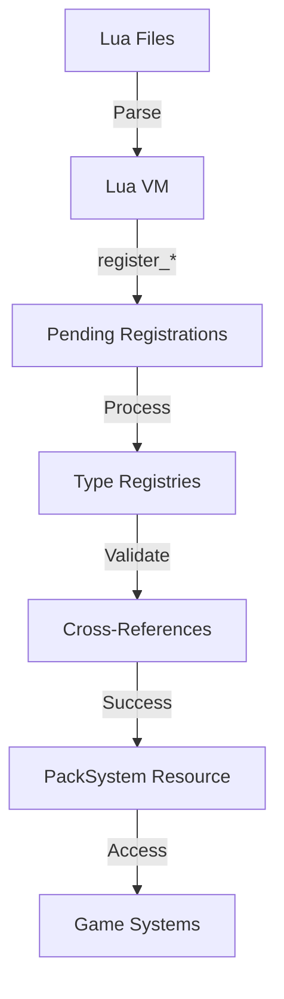

# Pack System Technical Documentation

## Overview

The Pack System is a comprehensive data-driven content management system for the World Simulator, inspired by successful modding architectures from Minecraft Forge and Factorio. It enables all game content to be defined externally in Lua scripts, eliminating hardcoded data and enabling robust modding support.

## Architecture

### Core Components

```
world_sim_simple/
├── src/
│   └── packs/
│       ├── mod.rs           # Main PackSystem struct and plugin
│       ├── registry.rs      # Generic registry trait and implementations
│       ├── definitions.rs   # Data structure definitions
│       └── loader_v2.rs     # Lua loading and API binding
│
assets/
└── packs/
    └── dev-world/           # Default content pack
        ├── pack.lua         # Pack metadata
        └── data/
            ├── resources/   # Natural resources
            ├── items/       # Inventory items
            ├── recipes/     # Crafting recipes
            ├── entities/    # Units and buildings
            └── world/       # World generation
```

### Data Flow



## Registry System

### Generic Registry Trait

```rust
pub trait Registry<T> {
    fn register(&mut self, id: String, definition: T) -> Result<(), PackError>;
    fn get(&self, id: &str) -> Option<&T>;
    fn get_mut(&mut self, id: &str) -> Option<&mut T>;
    fn exists(&self, id: &str) -> bool;
    fn get_all(&self) -> Vec<&T>;
    fn count(&self) -> usize;
    fn validate(&self) -> Result<(), PackError>;
}
```

### Specialized Registries

- **ResourceRegistry**: Natural resources (trees, ores, plants)
- **ItemRegistry**: Items that can exist in inventory
- **RecipeRegistry**: Crafting recipes and requirements
- **EntityRegistry**: Units, buildings, and other entities

## Lua API

### Resource Registration

```lua
register_resource {
    id = "berry_bush",
    name = "Berry Bush",
    category = "plant",
    properties = {
        weight = 0,
        stack_size = 0,
        base_value = 0,
    },
    harvestable = {
        tool_required = nil,
        yield = {
            { item = "berries", min = 2, max = 5 }
        },
        respawn_time = 300.0,
    },
    spawn = {
        biomes = { "forest", "meadow" },
        frequency = 0.8,
        cluster_size = { min = 1, max = 3 },
    }
}
```

### Item Registration

```lua
register_item {
    id = "berries",
    name = "Berries",
    category = "food",
    properties = {
        weight = 0.1,
        stack_size = 20,
        value = 2,
    },
    consumable = {
        effects = {
            { effect_type = "hunger", amount = 10.0 }
        },
        perishable = true,
        perish_time = 600.0,
    }
}
```

### Recipe Registration

```lua
register_recipe {
    id = "wooden_pickaxe",
    name = "Wooden Pickaxe",
    category = "tools",
    requirements = {
        { item = "wood", count = 3 },
        { item = "plant_fiber", count = 2 }
    },
    outputs = {
        { item = "wooden_pickaxe", count = 1 }
    },
    crafting = {
        time = 5.0,
        station = nil,  -- Can be crafted anywhere
    }
}
```

### Entity Registration

```lua
register_entity {
    id = "peasant",
    name = "Peasant",
    entity_type = "unit",
    properties = {
        health = 100.0,
        max_health = 100.0,
        size = { x = 1, y = 1 },
    },
    unit = {
        movement_speed = 50.0,
        energy = 100.0,
        max_energy = 100.0,
        needs = {
            hunger_decay = 0.1,
            energy_decay = 0.05,
        },
        inventory = {
            slots = 8,
        },
        behaviors = { "gather", "build", "craft" },
    }
}
```

## Loading Process

### 1. Pack Discovery
```rust
let pack_path = "assets/packs/dev-world";
let pack_system = PackSystem::load_pack(pack_path)?;
```

### 2. Metadata Loading
```lua
-- pack.lua
return {
    id = "dev-world",
    name = "Development World",
    version = "0.1.0",
    load_order = {
        "resources",
        "items",
        "recipes",
        "entities",
        "world"
    }
}
```

### 3. Category Loading
- Each category in `load_order` is processed sequentially
- All `.lua` files in category directories are loaded
- Lua `register_*` functions queue definitions for processing

### 4. Registration Processing
- After all Lua files are executed, pending registrations are processed
- Each definition is added to its appropriate registry
- Duplicate IDs trigger errors

### 5. Validation
- Individual registry validation (required fields, value ranges)
- Cross-reference validation (items reference valid resources, etc.)
- Circular dependency detection

## Thread Safety

The system uses `Arc<Mutex<VecDeque>>` for thread-safe pending registrations:

```rust
pub struct PendingRegistrations {
    resources: Arc<Mutex<VecDeque<ResourceDefinition>>>,
    items: Arc<Mutex<VecDeque<ItemDefinition>>>,
    recipes: Arc<Mutex<VecDeque<RecipeDefinition>>>,
    entities: Arc<Mutex<VecDeque<EntityDefinition>>>,
}
```

This allows Lua callbacks to safely queue registrations from any thread.

## Integration with Bevy ECS

The PackSystem is registered as a Bevy Resource:

```rust
impl Plugin for PackSystemPlugin {
    fn build(&self, app: &mut App) {
        let pack_system = PackSystem::load_pack("assets/packs/dev-world")
            .expect("Failed to load pack");
        app.insert_resource(pack_system);
    }
}
```

Game systems access pack data through the resource:

```rust
fn spawn_resources(
    pack_system: Res<PackSystem>,
    mut commands: Commands,
) {
    for resource in pack_system.resource_registry.get_all() {
        if let Some(spawn) = &resource.spawn {
            // Spawn resource entities based on definition
        }
    }
}
```

## Hot Reload Support

When enabled in pack configuration:

```lua
config = {
    allow_hot_reload = true
}
```

The system can detect file changes and reload definitions:
- File watcher monitors pack directories
- Changed files trigger selective reloading
- Existing entities are updated or respawned
- Validation ensures consistency

## Error Handling

```rust
pub enum PackError {
    MetadataNotFound(PathBuf),
    InvalidMetadata(String),
    LuaError { file: PathBuf, error: LuaError },
    IoError(std::io::Error),
    ValidationError(String),
    DuplicateId(String),
    CategoryNotFound(String),
}
```

Errors are propagated with context about file location and error type.

## Performance Considerations

### Loading Performance
- One-time cost at startup
- Lazy loading possible for large packs
- Parallel loading within categories (future optimization)

### Runtime Performance
- No runtime parsing - all definitions loaded at startup
- Direct hashmap lookups for definitions
- No reflection or dynamic dispatch overhead

### Memory Usage
- Definitions stored in optimized Rust structs
- Shared string interning for common values (future optimization)
- Unused definitions can be pruned

## Extension Points

### Custom Definition Types
New definition types can be added by:
1. Adding struct to `definitions.rs`
2. Creating new registry type
3. Adding Lua registration function
4. Implementing validation logic

### Custom Validators
```rust
impl MyCustomRegistry {
    fn validate_special_rules(&self) -> Result<(), PackError> {
        // Custom validation logic
    }
}
```

### Pack Preprocessors
Transform or generate Lua files before loading:
- Template expansion
- Localization injection
- Configuration overlays

## Best Practices

### File Organization
```
data/
├── resources/
│   ├── plants/
│   │   ├── berry_bush.lua
│   │   ├── wheat.lua
│   │   └── trees/
│   │       ├── oak.lua
│   │       └── pine.lua
│   └── minerals/
│       ├── stone.lua
│       ├── iron_ore.lua
│       └── coal.lua
```

### Naming Conventions
- IDs: `snake_case` (e.g., `iron_pickaxe`)
- Files: Match ID with `.lua` extension
- Categories: Plural nouns (`resources`, `items`)

### Validation Strategy
1. Required fields enforced in Rust structs
2. Value ranges checked during registration
3. Cross-references validated after loading
4. Game-specific rules in custom validators

### Performance Guidelines
- Minimize file count by grouping related content
- Use categories to control load order
- Cache frequently accessed definitions
- Avoid complex Lua computations

## Migration Path

### Phase 1: Infrastructure (Complete)
- [x] Create registry system
- [x] Implement Lua loader
- [x] Add validation framework

### Phase 2: Content Migration
- [ ] Convert hardcoded enums to dynamic IDs
- [ ] Migrate existing content to Lua
- [ ] Update spawning systems

### Phase 3: System Integration
- [ ] Replace direct enum usage
- [ ] Update save/load system
- [ ] Integrate with networking

### Phase 4: Advanced Features
- [ ] Hot reload implementation
- [ ] Pack layering/inheritance
- [ ] Development tools

## Security Considerations

### Sandboxed Lua Environment
- No file system access
- No network access
- No OS functions
- Limited to registration APIs

### Validation Requirements
- All user input sanitized
- Path traversal prevention
- Size limits on definitions
- Rate limiting for hot reload

## Debugging

### Enable Debug Logging
```lua
config = {
    debug = true
}
```

### Common Issues

| Issue | Cause | Solution |
|-------|-------|----------|
| "Duplicate ID" | Same ID registered twice | Ensure unique IDs |
| "Unknown item" | Reference to undefined item | Check load order |
| "Lua error" | Syntax error in Lua file | Check file syntax |
| "Validation failed" | Invalid cross-reference | Verify all references |

## Future Enhancements

### Pack Inheritance
```lua
dependencies = { "base-pack", "expansion-pack" }
```

### Conditional Loading
```lua
if GAME_MODE == "survival" then
    register_resource { ... }
end
```

### Pack Marketplace
- In-game pack browser
- Automatic dependency resolution
- Version compatibility checking
- Digital signatures for security

### Visual Editor
- GUI for creating/editing definitions
- Live preview of changes
- Validation feedback
- Export to Lua format

## Conclusion

The Pack System provides a robust, extensible foundation for data-driven game development. By separating content from code, it enables rapid iteration, modding support, and long-term maintainability. The architecture balances flexibility with performance, ensuring the system can grow with the game's needs.