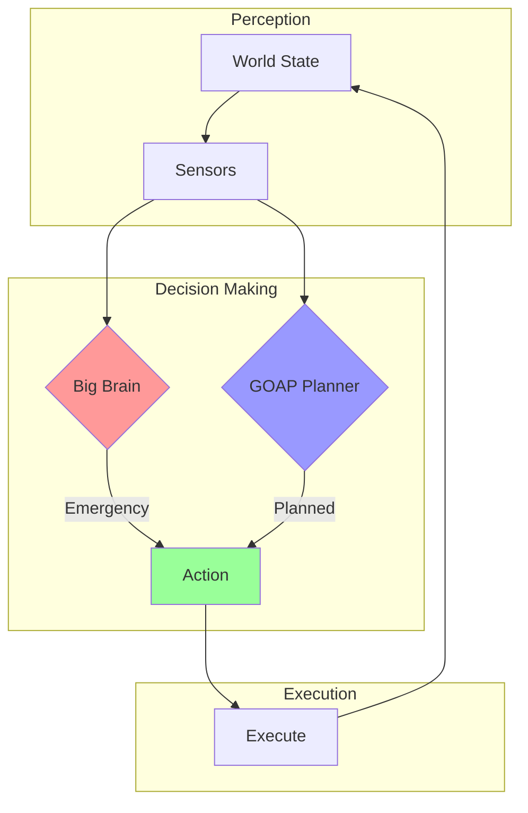

# World Simulator Documentation

Welcome to the World Simulator documentation! This guide will help you understand how our autonomous agents think, plan, and survive in the simulated world.

## 📚 Documentation Index

### 🏗️ Architecture
- [System Overview](architecture/overview.md) - High-level architecture and design
- [Core Components](architecture/components.md) - Understanding the building blocks
- [Tick System](architecture/tick-system.md) - How the simulation runs

### 🧠 Behavior System
- [Behavior Overview](behavior-system/README.md) - How units make decisions
- [GOAP Planning](behavior-system/goap-planning.md) - Goal-oriented action planning
- [Big Brain Reactive](behavior-system/big-brain-reactive.md) - Immediate response system
- [System Coordination](behavior-system/coordination.md) - How dual-AI systems work together
- [Decision Flow](behavior-system/decision-flow.md) - Complete decision-making process

### 💪 Needs & Survival System
- [Needs Overview](needs-system/overview.md) - How units stay alive
- [Energy Management](needs-system/energy-management.md) - Three-layer energy protection
- [Hunger System](needs-system/hunger-system.md) - Food gathering and consumption
- [Work System](needs-system/work-system.md) - Resource gathering and tasks

### 📖 Guides
- [Quick Start](guides/quick-start.md) - Get up and running quickly
- [Adding Behaviors](guides/adding-behaviors.md) - Extend the AI system
- [Debugging Guide](guides/debugging.md) - Troubleshooting and tips

### 📚 War Stories & Caveats
- [The Great Berry Bush Regeneration Fiasco](caveats/the-great-berry-bush-regeneration-fiasco.md) - How 7.5 hours were lost to `&mut`
- [Tick Accumulator Fix](TICK_ACCUMULATOR_FIX.md) - Preventing the spiral of death in tick-based simulation

### 🏰 Design & Inspiration
- [Dwarf Fortress Features](DWARF_FORTRESS_FEATURES.md) - Features inspired by the legendary simulation game

## 🎯 Key Concepts

### Autonomous Agents
Our units are fully autonomous - they manage their own needs without player intervention:
- **Hunger**: Units find and consume food when hungry
- **Energy**: Units rest and nap when tired
- **Planning**: Units plan ahead to meet future needs
- **Reactions**: Units respond immediately to critical situations

### Dual-AI System
We use two complementary AI systems:
1. **GOAP** (Goal-Oriented Action Planning): Long-term planning and goal achievement
2. **Big Brain**: Immediate reactions to critical needs

### Tick-Based Simulation
The world updates in discrete "ticks" (10 per second by default), not every frame. This ensures consistent behavior regardless of framerate.

## 🚀 Getting Started

New to the World Simulator? Start here:
1. Read the [System Overview](architecture/overview.md)
2. Understand [How Units Think](behavior-system/README.md)
3. Follow the [Quick Start Guide](guides/quick-start.md)

## 📊 System at a Glance

## 🔧 Contributing

To add new behaviors or modify existing ones, see our [Adding Behaviors Guide](guides/adding-behaviors.md).

---

*This documentation covers the World Simulator engine as of the latest version with three-layer energy management and dual-AI behavior system.*