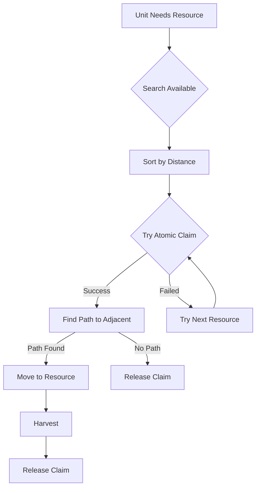

# Atomic Resource Claiming System

## Overview

The atomic resource claiming system ensures that multiple units cannot allocate the same resource slot simultaneously, preventing race conditions and resource conflicts in the simulation. This system was implemented to solve the "multiple units on same grid cell" bug that occurred during resource harvesting.

## The Problem: Race Conditions in Resource Allocation

### Original Issue
Before atomic claiming, the resource allocation flow had a critical race condition:

```
Time T0: Unit A checks berry bush → Available (0/1 workers)
Time T1: Unit B checks berry bush → Available (0/1 workers)
Time T2: Unit A decides to harvest → Starts moving
Time T3: Unit B decides to harvest → Starts moving
Time T4: Both units arrive at same resource → Conflict!
```

The gap between checking availability and claiming the resource allowed multiple units to target the same slot.

### Symptoms
- Multiple units occupying the same grid cell
- Units overlapping while harvesting
- Resource worker limits not being respected
- Wasted movement when units arrived at already-claimed resources

## The Solution: Atomic Claiming

### What Makes It "Atomic"?

In computer science, an **atomic operation** is one that:
- Executes as a single, indivisible unit
- Cannot be interrupted by other operations
- Either completes entirely or not at all
- Has no observable intermediate states

Our resource claiming is atomic because the check-and-claim happen as one indivisible operation.

### Implementation Details

#### 1. Atomic Try-Claim Method
```rust
// In ResourceNode component
pub fn try_claim_with_timeout(&mut self, claimer: Entity, current_tick: u32) -> bool {
    // Entire function executes atomically
    self.cleanup_expired_claims(current_tick);

    if self.claimed_by.contains_key(&claimer) {
        // Already claimed - refresh timestamp
        self.claimed_by.insert(claimer, current_tick);
        return true;
    }

    // Check AND claim in single step (atomic!)
    if self.claimed_by.len() < self.max_workers {
        self.claimed_by.insert(claimer, current_tick);
        return true;  // Success
    }

    false  // No room - claim failed
}
```

#### 2. Claim-Before-Move Pattern
```rust
// In food_search_movement_system
for (resource_entity, position, _) in available_resources {
    // Try atomic claim FIRST
    if !resource.try_claim_with_timeout(unit, tick) {
        continue;  // Failed - try next resource
    }

    // Only pathfind AFTER successful claim
    if let Some(path) = find_path(position) {
        movement.set_path(path);
        break;
    } else {
        // No path - release claim
        resource.release_claim(unit);
    }
}
```

## System Architecture

### Components Involved

1. **ResourceNode**
   - Manages `claimed_by: HashMap<Entity, u32>`
   - Tracks worker claims with timestamps
   - Enforces `max_workers` limits per resource type

2. **ClaimedResource**
   - Unit-side tracking of claimed resource entity
   - Ensures units remember their claims

3. **GridOccupationMap**
   - Prevents physical overlap on grid cells
   - Resources marked as solid obstacles
   - Units harvest from adjacent tiles

### Resource Worker Limits
- **Berry Bushes**: 1 worker maximum
- **Rock Deposits**: 4 workers maximum
- **Trees**: 2 workers maximum

### Claim Lifecycle



## Key Guarantees

### 1. Mutual Exclusion
Only up to `max_workers` units can ever claim a resource simultaneously.

### 2. No Over-Allocation
Impossible for two units to claim the last available slot due to atomic operation.

### 3. No Wasted Movement
Units only begin moving after successfully securing a resource claim.

### 4. Automatic Cleanup
Claims expire after timeout (200 ticks for trees, 100 for others) if unit disconnects.

### 5. Fair Distribution
First unit to execute `try_claim` gets the slot - no bias or priority system.

## Why This Works in Rust/Bevy

The atomic guarantees are enforced by:

1. **Rust's Ownership System**
   - `&mut ResourceNode` ensures exclusive mutable access
   - Borrow checker prevents data races at compile time

2. **Bevy's ECS Architecture**
   - Systems run in defined order
   - Query access is controlled by the scheduler
   - Mutable queries prevent concurrent modification

3. **Single-Threaded Execution**
   - Resource claiming happens in main thread
   - No true parallelism for resource mutations

## Usage Example

```rust
// Movement system with atomic claiming
pub fn resource_harvesting_movement_system(
    mut resources: Query<&mut ResourceNode>,
    // ... other queries
) {
    // Collect and sort available resources
    let mut available = collect_available_resources();
    available.sort_by_distance();

    // Try claiming with retry logic
    const MAX_ATTEMPTS: usize = 5;
    for (entity, position) in available.take(MAX_ATTEMPTS) {
        // Atomic claim attempt
        if let Ok(mut resource) = resources.get_mut(entity) {
            if !resource.try_claim_with_timeout(unit, current_tick) {
                continue;  // Try next
            }

            // Success - proceed with movement
            set_movement_target(position);
            break;
        }
    }
}
```

## Testing the System

### Verification Steps
1. Spawn multiple units near a single berry bush (max_workers = 1)
2. Make all units hungry simultaneously
3. Observe: Only one unit should move to harvest
4. Other units should seek different resources

### Debug Logging
The system includes debug logs for:
- `CLAIM_SUCCESS`: Unit successfully claimed resource
- `CLAIM_FAILED`: Claim attempt rejected
- `CLAIM_RELEASED_NO_PATH`: Claim released due to pathfinding failure
- `NO_CLAIMABLE_RESOURCES`: All nearby resources fully claimed

## Performance Considerations

- **O(1)** claim operation (HashMap insertion)
- **O(n)** cleanup of expired claims (every 50 ticks)
- Retry limit prevents infinite loops
- Distance sorting optimizes pathfinding attempts

## Future Improvements

Potential enhancements to consider:

1. **Priority-based claiming**: Higher-level units get priority
2. **Reservation system**: Pre-claim resources while moving
3. **Work queues**: Units queue for busy resources
4. **Dynamic worker limits**: Adjust based on resource abundance
5. **Claim trading**: Units can transfer claims to closer units

## Related Systems

- [Grid Occupation System](./grid-occupation.md)
- [Movement System](./movement-system.md)
- [Resource Harvesting](./resource-harvesting.md)
- [Pathfinding](./pathfinding.md)