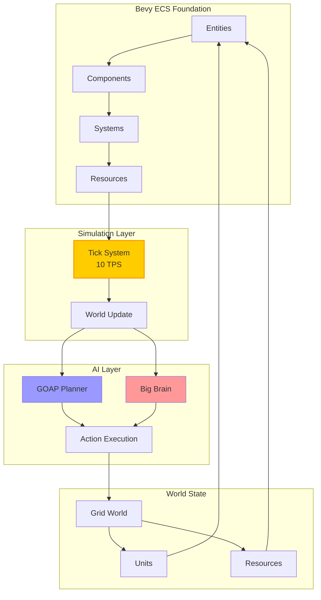
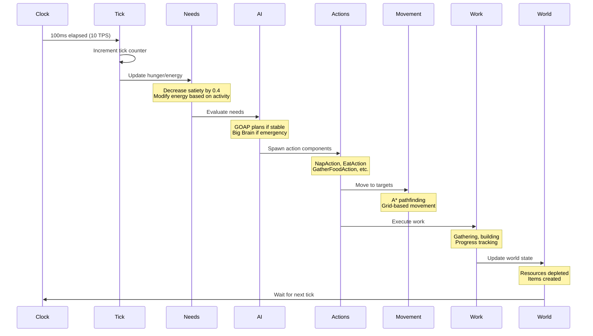
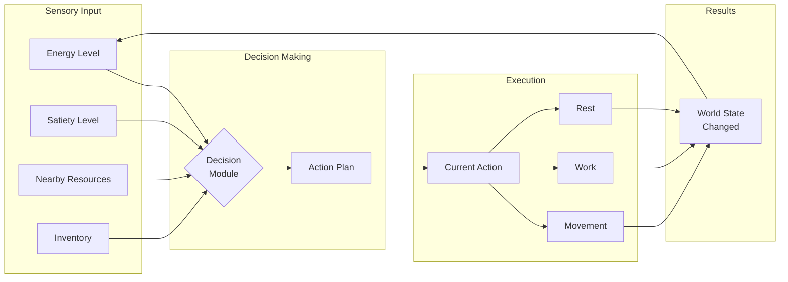

# System Architecture Overview

The World Simulator is built on a robust Entity Component System (ECS) architecture using Bevy, with tick-based simulation and dual-AI decision making.

## 🏗️ Core Architecture



## 🎮 Key Components

### Entities
Every object in the world is an Entity with Components:
- **Units** (Peasants): Autonomous agents with needs
- **Resources**: Berry bushes, trees, stones
- **Buildings**: Structures units can build
- **Work Sites**: Locations where work happens

### Core Components

#### Unit Components
```rust
// Identity
NameComponent       // Unit's name
UnitTag            // Marks entity as a unit

// Position & Movement
GridPosition       // Current tile position
GridMovement       // Movement state and pathfinding
Transform          // Visual position (interpolated)

// Needs & State
Energy(f64)        // 0-100, depletes with activity
Satiety(f64)       // 0-100, depletes over time
FoodCount(f64)     // Inventory food items

// Work
WorkProgress       // Current work task progress
WorkSpeed          // Work efficiency modifier

// AI Components
Planner            // GOAP planner
Thinker            // Big Brain thinker
```

#### Resource Components
```rust
ResourceNode       // Resource type and amount
BerryBushTag      // Identifies berry bushes
Harvestable       // Can be gathered from
GridPosition      // Location on grid
```

## 🔄 System Flow

The simulation updates in this order every tick:



## 📊 Data Flow

### Input → Decision → Action → Result



## 🕐 Tick-Based Simulation

### Why Ticks?
- **Deterministic**: Same behavior regardless of framerate
- **Efficient**: Updates only when needed
- **Synchronized**: All systems update together
- **Reproducible**: Can replay from saves

### Tick Rate
- **Default**: 10 ticks per second (100ms per tick)
- **Configurable**: Can speed up/slow down simulation
- **Frame-Independent**: Rendering at 60 FPS, logic at 10 TPS

## 🧩 System Modules

### Core Systems

| System | Purpose | Update Rate |
|--------|---------|-------------|
| `tick_manager` | Manages simulation ticks | Every frame |
| `needs_update` | Updates hunger/energy | Every tick |
| `goap_planning` | Long-term planning | Every tick |
| `big_brain` | Emergency responses | Every tick |
| `movement` | Grid movement & pathfinding | Every tick |
| `work_system` | Resource gathering | Every tick |
| `consumption` | Eating and drinking | Every tick |

### Support Systems

| System | Purpose | Update Rate |
|--------|---------|-------------|
| `interpolation` | Smooth visual movement | Every frame |
| `animation` | Sprite animations | Every frame |
| `ui_update` | HUD and menus | Every frame |
| `save_load` | Persistence | On demand |
| `debug_monitor` | Development tools | Every frame |

## 🔌 Plugin Architecture

The system is modular with plugins:

```rust
App::new()
    .add_plugins(DefaultPlugins)
    .add_plugins(SimulationPlugin)    // Core tick system
    .add_plugins(BevyDogoapPlugin)     // GOAP planning
    .add_plugins(BigBrainPlugin)       // Reactive AI
    .add_plugins(MovementPlugin)       // Movement system
    .add_plugins(WorkPlugin)           // Work system
    .add_plugins(UIPlugin)             // User interface
```

## 📦 Resource Management

### Global Resources
- `SimulationState`: Current tick, speed, paused state
- `TickAccumulator`: Manages tick timing
- `DebugSystem`: Logging and debugging
- `ResourceClaims`: Prevents resource conflicts

### Component Storage
- **Dense Storage**: Frequently accessed (Position, Energy)
- **Sparse Storage**: Rarely accessed (WorkProgress)
- **Table Storage**: Groups of related components

## 🎯 Design Principles

1. **Autonomy First**: Units must survive without player input
2. **Emergence**: Complex behavior from simple rules
3. **Performance**: Handle 100+ units smoothly
4. **Modularity**: Easy to extend with new behaviors
5. **Debuggability**: Clear logs and visualization

## Next Steps

- Understand the [Tick System](tick-system.md) in detail
- Learn about [Core Components](components.md)
- Explore the [Behavior System](../behavior-system/README.md)
- See [Movement System](../movement-pathfinding.md)