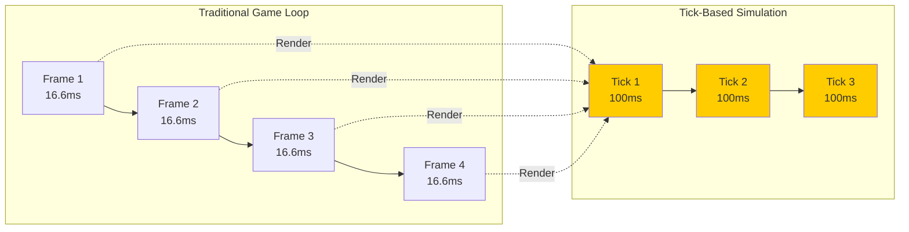
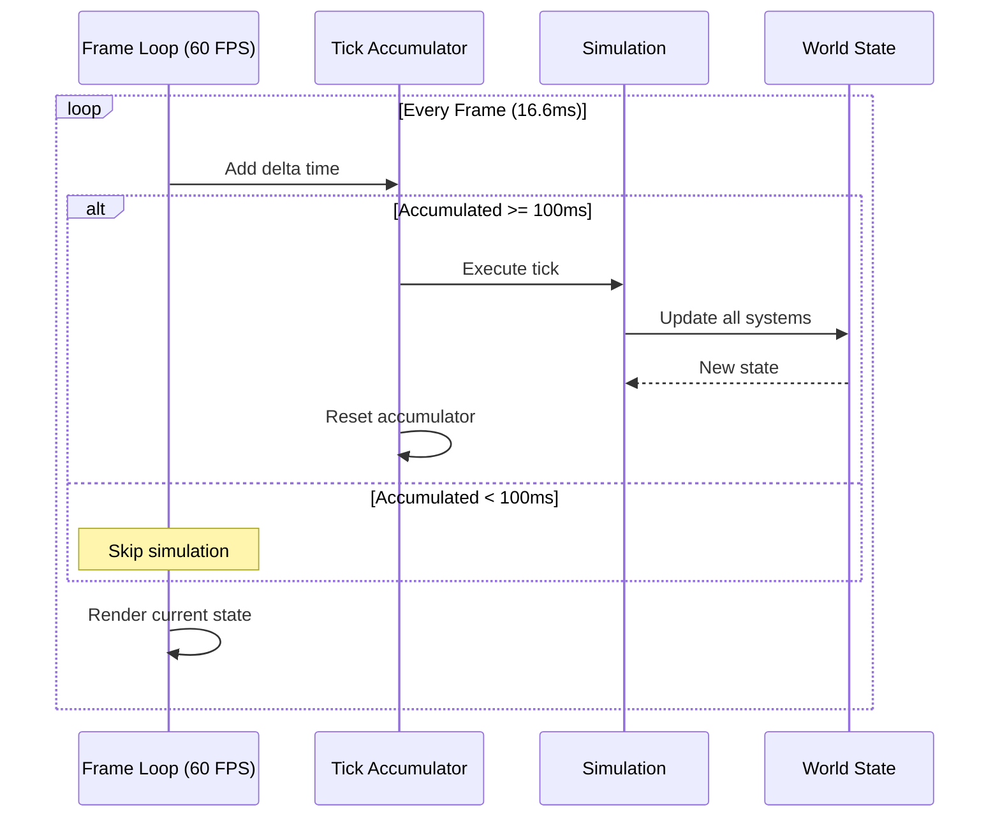
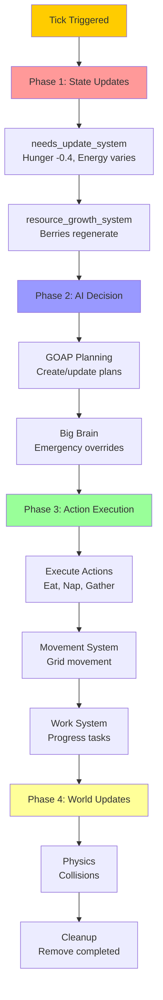
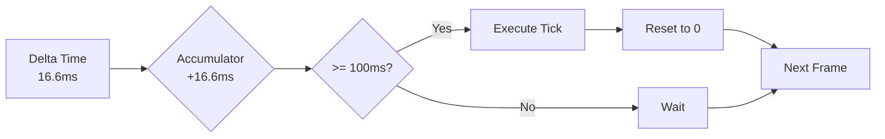

# Tick-Based Simulation System

The World Simulator uses a tick-based simulation model inspired by games like Dwarf Fortress and Factorio, where the world updates in discrete time steps independent of rendering framerate.

## 🕐 What is a Tick?

A **tick** is a single discrete update of the simulation. All game logic happens on ticks, not frames.



### Key Differences

| Aspect | Frame-Based | Tick-Based |
|--------|------------|------------|
| **Update Rate** | 60 FPS (variable) | 10 TPS (fixed) |
| **Determinism** | Depends on framerate | Always consistent |
| **Logic Updates** | Every frame | Every tick |
| **Visual Updates** | Every frame | Interpolated |
| **CPU Usage** | High (60 updates/sec) | Low (10 updates/sec) |

## ⚙️ Tick Configuration

### Default Settings
```rust
pub const TICKS_PER_SECOND: u32 = 10;
pub const TICK_DURATION: f32 = 0.1; // 100ms
```

### Simulation Speeds
```rust
pub enum SimulationSpeed {
    Paused,      // 0x - Stopped
    Slow,        // 0.5x - 5 TPS
    Normal,      // 1x - 10 TPS
    Fast,        // 2x - 20 TPS
    VeryFast,    // 5x - 50 TPS
    UltraFast,   // 10x - 100 TPS
}
```

## 🔄 The Tick Loop



## 📊 System Update Order

Every tick, systems update in this specific order:



## 🎮 Tick Accumulator

The TickAccumulator manages timing:

```rust
pub struct TickAccumulator {
    accumulated: f32,        // Time since last tick
    speed: SimulationSpeed,  // Current speed setting
    pending_ticks: u32,      // Ticks to execute
    actual_tps: f32,        // Measured performance
}
```

### Accumulation Process


### Preventing Spiral of Death
When the simulation can't keep up:
```rust
if accumulated > TICK_DURATION * 3.0 {
    accumulated = TICK_DURATION * 3.0; // Cap at 3 ticks
}
```

## 📈 Per-Tick Updates

### Needs System (Every Tick)
```rust
// Hunger increases
satiety -= 0.4;  // 4 per second

// Energy changes based on activity
if working {
    energy -= 0.4 to 0.8;  // Varies by work type
} else if moving {
    energy -= 0.05;        // Minimal drain
} else {
    energy += 0.5;         // Recovery when idle
}
```

### Work Progress (Every Tick)
```rust
// Work advances by fixed amounts
if working {
    progress += GATHER_PROGRESS_PER_TICK;  // 333 per tick
    if progress >= MAX_WORK_PROGRESS {     // 10,000 total
        complete_work();                   // ~30 ticks to gather
    }
}
```

### Movement (Every 3 Ticks)
```rust
// Grid movement is tick-based
movement_progress += MOVE_PROGRESS_PER_TICK;
if movement_progress >= MAX_WORK_PROGRESS {
    // Move to next tile
    grid_position = next_tile;
    movement_progress = 0;
}
```

## 🎯 Visual Interpolation

While logic updates at 10 TPS, visuals update at 60 FPS:

```mermaid
graph TD
    subgraph "Logic Layer (10 TPS)"
        L1[Tile (5,5)] --> L2[Tile (6,5)]
    end

    subgraph "Visual Layer (60 FPS)"
        V1[Pos 5.0] --> V2[Pos 5.16]
        V2 --> V3[Pos 5.33]
        V3 --> V4[Pos 5.50]
        V4 --> V5[Pos 5.66]
        V5 --> V6[Pos 5.83]
        V6 --> V7[Pos 6.0]
    end

    L1 -.->|Start| V1
    L2 -.->|End| V7

    style L1 fill:#ffcc00
    style L2 fill:#ffcc00
```

### Interpolation System
```rust
// Every frame (not tick)
pub fn interpolate_movement(
    mut query: Query<(&GridPosition, &mut Transform)>
) {
    for (grid_pos, mut transform) in query.iter_mut() {
        let target = grid_to_world(grid_pos);
        transform.translation = transform.translation.lerp(target, 0.1);
    }
}
```

## 🔍 Debugging Ticks

### Tick Counter Display
```rust
// Current tick and TPS
Tick: 1523 | Speed: 2.0x | TPS: 19.8/20.0
```

### Tick Markers in Logs
```
[100.342] [TICK] === TICK 1523 ===
[100.342] [NEEDS] Updating needs...
[100.343] [GOAP] Planning...
[100.344] [MOVE] Processing movement...
```

### Common Tick Issues

| Issue | Cause | Solution |
|-------|-------|----------|
| **Lag Spikes** | Too many units | Reduce unit count or optimize |
| **Stuttering** | Irregular ticks | Check CPU usage, reduce speed |
| **Desync** | Logic in render | Move logic to tick systems |
| **Too Fast** | High speed setting | Reduce simulation speed |

## 🎨 Frame vs Tick Systems

### Tick-Based Systems ✅
- AI decisions
- Movement logic
- Work progress
- Need updates
- Resource growth
- Combat resolution

### Frame-Based Systems 🖼️
- Visual interpolation
- Particle effects
- UI updates
- Camera movement
- Input handling
- Audio playback

## 📊 Performance Considerations

### Tick Budget
At 10 TPS, each tick has 100ms to complete:
```
Needs Update:     5ms
AI Planning:     20ms
Movement:        10ms
Work System:     10ms
Other Systems:   15ms
-------------------
Total:          60ms (60% utilization)
Buffer:         40ms (for spikes)
```

### Optimization Strategies
1. **Batch Updates**: Process similar entities together
2. **Spatial Indexing**: Quick neighbor lookups
3. **Lazy Evaluation**: Only update what changed
4. **System Ordering**: Dependencies first
5. **Parallel Systems**: Use Bevy's parallelization

## 🔧 Configuration

### Changing Tick Rate
```rust
// In tick_config.rs
pub const TICKS_PER_SECOND: u32 = 20;  // Faster simulation
pub const TICK_DURATION: f32 = 0.05;   // 50ms per tick
```

### Dynamic Speed Control
```rust
// Runtime speed changes
tick_accumulator.set_speed(SimulationSpeed::Fast);
```

## Next Steps

- Understand [System Architecture](overview.md)
- Learn about [Core Components](components.md)
- Explore [Movement System](../movement-pathfinding.md)
- Read about [Work System](../needs-system/work-system.md)