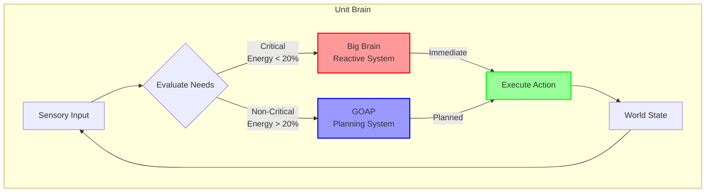
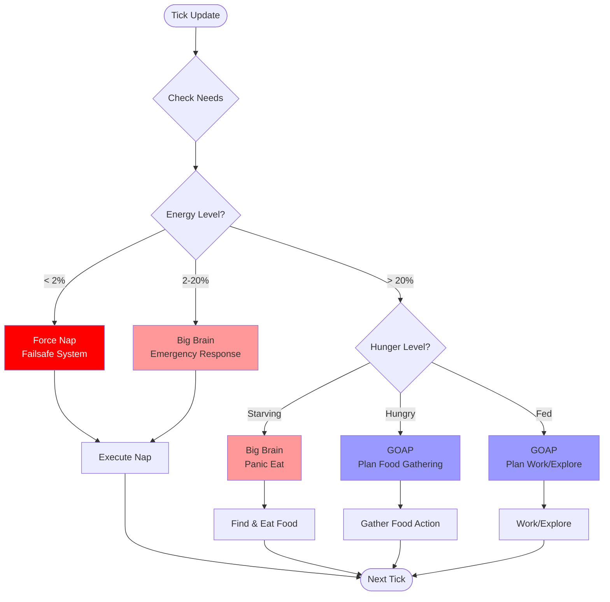
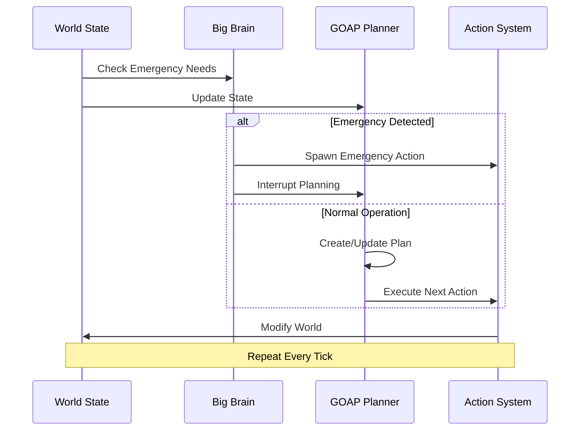

# Behavior System Overview

The World Simulator uses a sophisticated dual-AI system to create autonomous, intelligent units that can survive and thrive without player intervention.

## 🧠 The Dual-AI Architecture

Our units use two complementary AI systems that work together:

### 1. GOAP (Goal-Oriented Action Planning)
- **Purpose**: Long-term planning and goal achievement
- **When Active**: Normal conditions (energy > 20%)
- **Strength**: Creates efficient multi-step plans
- **Example**: Planning to gather food before getting hungry

### 2. Big Brain (Reactive System)
- **Purpose**: Immediate response to critical needs
- **When Active**: Emergency situations (energy < 20%, starving)
- **Strength**: Fast reactions without planning overhead
- **Example**: Emergency nap when energy critically low

## 🔄 Decision Flow

Here's how a unit makes decisions every tick:

## 🎯 Action Priority

Actions are prioritized based on urgency and system:

| Priority | System | Condition | Action |
|----------|--------|-----------|--------|
| 1 (Highest) | Failsafe | Energy ≤ 2% | Force Nap |
| 2 | Big Brain | Energy < 10% | Emergency Nap |
| 3 | Big Brain | Satiety < 10% | Panic Eat |
| 4 | Big Brain | Energy < 20% | Rest |
| 5 | GOAP | Energy < 30% | Plan Nap |
| 6 | GOAP | Satiety < 30% | Plan Food |
| 7 | GOAP | Has Task | Execute Work |
| 8 (Lowest) | GOAP | Idle | Explore/Wander |

## 🔧 How Actions Work

### 1. Action Selection
- **Big Brain**: Scores needs (0.0-1.0), highest score wins
- **GOAP**: Creates plan to achieve goals, executes first action

### 2. Action Execution
Actions are Components attached to entities:
- `NapAction`: Recovers energy over time
- `EatAction`: Consumes food to reduce hunger
- `GatherFoodAction`: Collects berries from bushes
- `MoveToResourceAction`: Pathfinds to resources

### 3. Action Completion
- Actions remove themselves when complete
- Planner re-evaluates after action completion
- Big Brain continuously monitors for emergencies

## 📊 System Coordination

The two AI systems coordinate through several mechanisms:

## 🎮 Practical Examples

### Example 1: Unit Gets Tired
1. Energy drops to 25% (GOAP threshold)
2. GOAP plans: Move to safe spot → Nap
3. Energy drops to 18% while moving
4. Big Brain interrupts with emergency rest
5. Unit naps immediately
6. After recovery, GOAP resumes normal planning

### Example 2: Starving Unit
1. Satiety at 5% (critical)
2. Big Brain triggers panic gather
3. Unit rushes to nearest berry bush
4. Eats immediately upon arrival
5. Once fed, GOAP takes over for normal planning

## 🔍 Debugging Behavior

To understand what your units are thinking:

1. **Check Active Components**:
   - `NapAction`, `EatAction`, etc. show current action
   - `Planner` component shows GOAP plan
   - `Score` components show Big Brain priorities

2. **Monitor Needs**:
   - Energy: 0-100 (below 20 is critical)
   - Satiety: 0-100 (below 30 triggers feeding)

3. **Watch Logs**:
   - `[GOAP_EXEC]`: GOAP planning decisions
   - `[BIG_BRAIN]`: Emergency responses
   - `[DOGOAP_FAILSAFE]`: Failsafe interventions

## Next Steps

- Learn about [GOAP Planning](goap-planning.md) in detail
- Understand [Big Brain Reactive System](big-brain-reactive.md)
- See how systems [Coordinate](coordination.md)
- Follow the complete [Decision Flow](decision-flow.md)