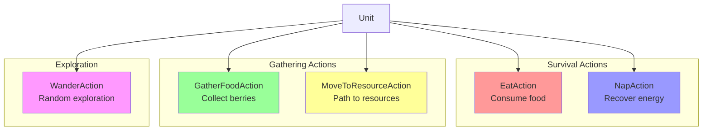
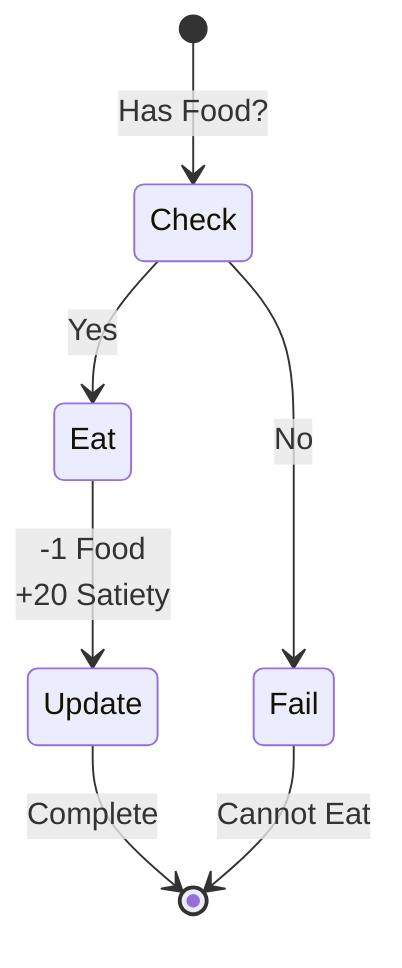
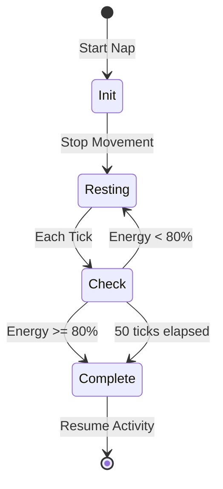
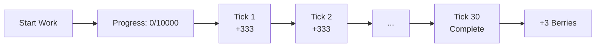
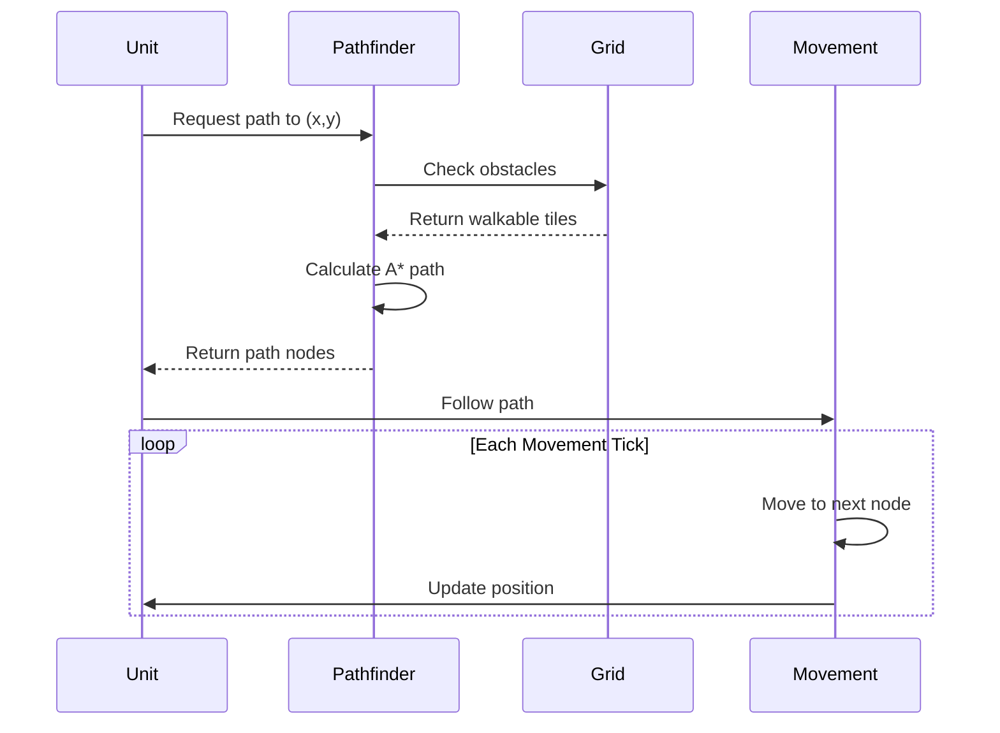
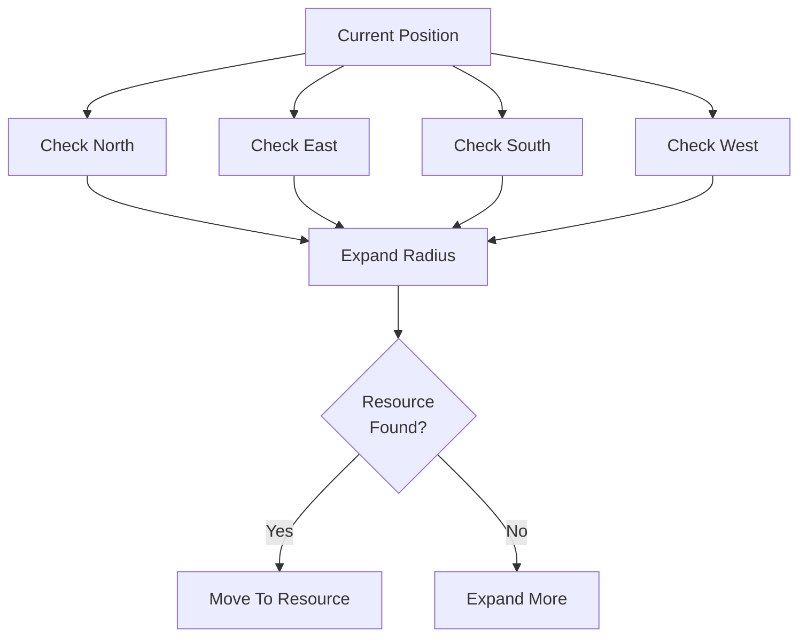
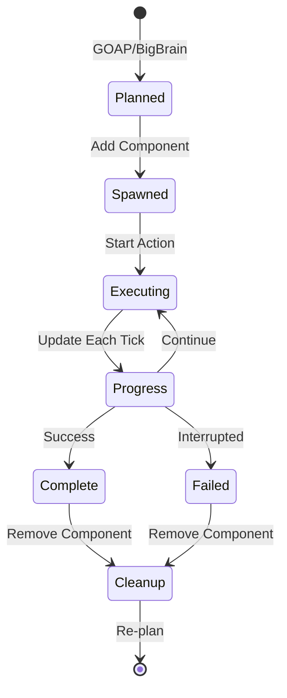

# Actions and Tasks Reference

Complete documentation of all actions units can perform in the World Simulator.

## 📋 Available Actions

### Core Actions Overview



## 🍽️ EatAction

**Purpose**: Consume food from inventory to reduce hunger

### Trigger Conditions
- Satiety < 30% (GOAP planning)
- Satiety < 10% (Big Brain emergency)
- FoodCount > 0 (must have food)

### Execution
```rust
// Per execution:
- Consumes: 1 food item from inventory
- Restores: 20 satiety points
- Duration: Instant (1 tick)
- Energy cost: None
```

### State Flow


## 😴 NapAction

**Purpose**: Rest to recover energy when exhausted

### Trigger Conditions
- Energy < 30% (GOAP preventive planning)
- Energy < 20% (Big Brain emergency)
- Energy < 2% (Failsafe forced)

### Execution
```rust
// Per tick during nap:
- Recovers: 1.6 energy per tick
- Duration: 50 ticks (5 seconds) or until 80% energy
- Movement: Stopped during nap
- Interruption: Only for critical emergencies
```

### Recovery Rates
| State | Energy/Tick | Time to Full |
|-------|------------|--------------|
| Napping | +1.6 | ~63 ticks |
| Idle | +0.5 | ~200 ticks |
| Moving | -0.05 | N/A |
| Working | -0.4 to -0.8 | N/A |

### State Flow


## 🫐 GatherFoodAction

**Purpose**: Collect berries from bushes

### Trigger Conditions
- FoodCount < 5 (need food)
- NearBerryBush = 1.0 (must be adjacent)
- Energy > 10% (need energy to work)

### Execution
```rust
// Gathering process:
- Duration: 30 ticks (3 seconds)
- Energy cost: 5 energy to start, 0.4 per tick
- Yield: 3 berries
- Work type: Gathering
- Tool bonus: 1.0x (no tools yet)
```

### Work Progress


### Resource Claims
- Claims berry bush when starting
- Prevents other units from harvesting same bush
- Claim released on completion or interruption
- 60-tick timeout on abandoned claims

## 🚶 MoveToResourceAction

**Purpose**: Navigate to resource locations

### Trigger Conditions
- Target resource identified
- Path can be calculated
- Not already at destination

### Execution
```rust
// Movement parameters:
- Speed: 3 ticks per tile
- Pathfinding: A* algorithm
- Range: Unlimited (full map)
- Collision: Avoids other units
```

### Pathfinding Process


### Movement States
- **Idle**: Not moving
- **Planning**: Calculating path
- **Moving**: Following path
- **Arrived**: Reached destination
- **Blocked**: Path obstructed

## 🌍 WanderAction

**Purpose**: Explore the world when no specific goal

### Trigger Conditions
- No urgent needs
- No resources nearby
- Default exploration behavior

### Execution
```rust
// Wander behavior:
- Searches for berry bushes
- Range: 10 tile radius
- Updates NearBerryBush state
- Transitions to MoveToResource when found
```

### Search Pattern


## 🔄 Action Lifecycle

All actions follow this general lifecycle:



## ⚙️ Work System Integration

Actions that involve work use the WorkProgress system:

### Work Types
```rust
enum WorkType {
    Gathering(ResourceWork),  // Berries, herbs
    Mining(ResourceWork),     // Stone, ore
    Building(BuildWork),      // Structures
    Farming(FarmWork),       // Planting, harvesting
    Crafting(CraftWork),     // Creating items
    Research(ResearchWork),  // Technology
    Repair(RepairWork),      // Fixing structures
}
```

### Work Progress Tracking
- Progress counter: 0 to 10,000
- Updates per tick based on work speed
- Can be interrupted and resumed
- Visual feedback through UI

## 🎯 Action Priority System

Actions are selected based on priority:

| Priority | Action | Trigger |
|----------|--------|---------|
| 0 | Force Nap | Energy ≤ 2% |
| 1 | Emergency Nap | Energy < 10% |
| 2 | Panic Eat | Satiety < 10% |
| 3 | Rest | Energy < 20% |
| 4 | Eat | Satiety < 30% |
| 5 | Gather Food | Food < 5 |
| 6 | Move to Food | Found food source |
| 7 | Wander | No urgent needs |

## 🔍 Debugging Actions

### Check Active Actions
```rust
// Query for current actions
Query<Entity, With<NapAction>>
Query<Entity, With<EatAction>>
Query<Entity, With<GatherFoodAction>>
```

### Monitor Action State
- Check `Planner.current_plan` for GOAP queue
- Check `ActionState` for Big Brain actions
- Watch `WorkProgress` for gathering/building

### Common Issues
1. **Stuck in Action**: Check if component wasn't removed
2. **Not Acting**: Verify needs thresholds
3. **Wrong Action**: Check priority conflicts
4. **Interrupted Work**: Look for claim conflicts

## Next Steps

- Learn about [GOAP Planning](goap-planning.md)
- Understand [Big Brain Reactions](big-brain-reactive.md)
- Explore [Movement System](../movement-pathfinding.md)
- Read about [Work System](../needs-system/work-system.md)