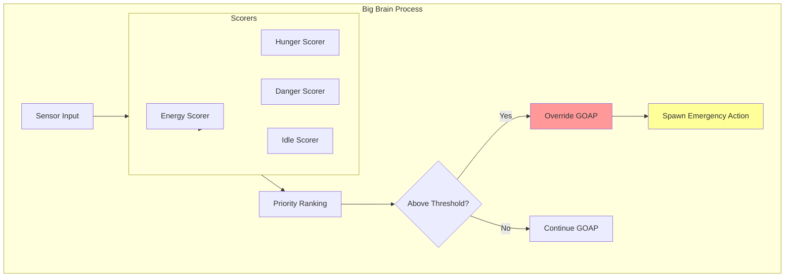
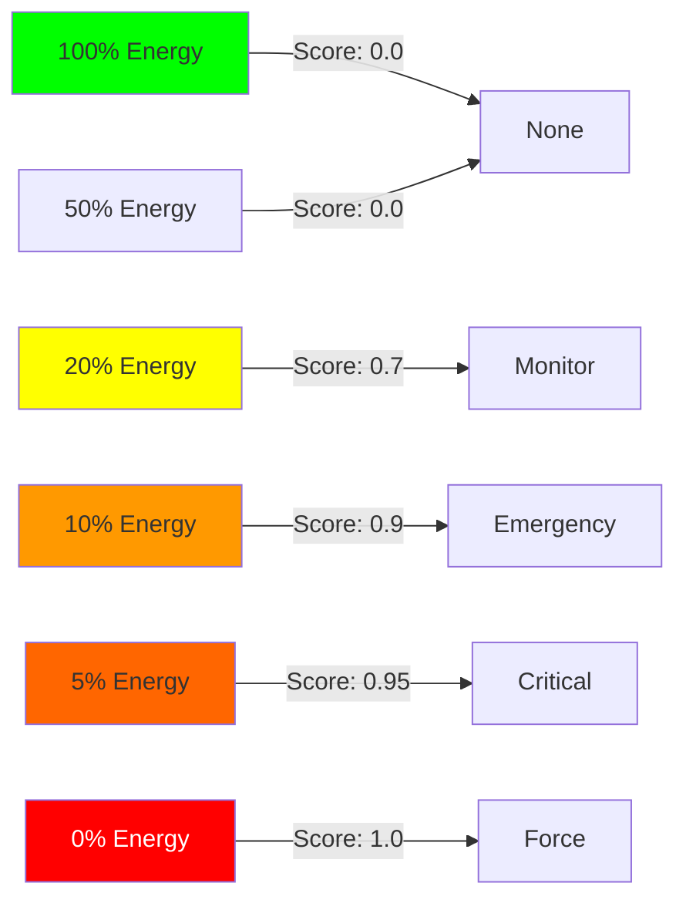
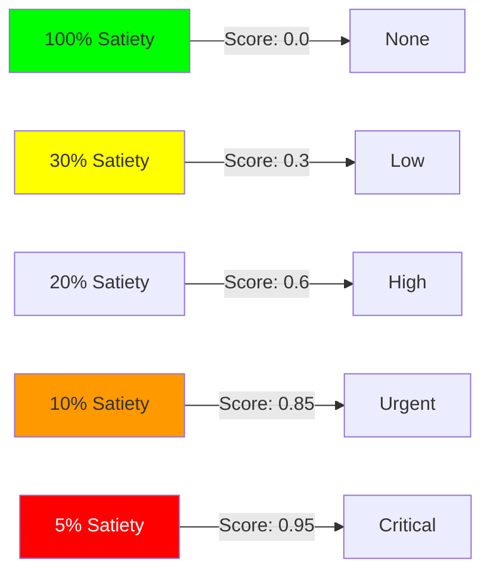
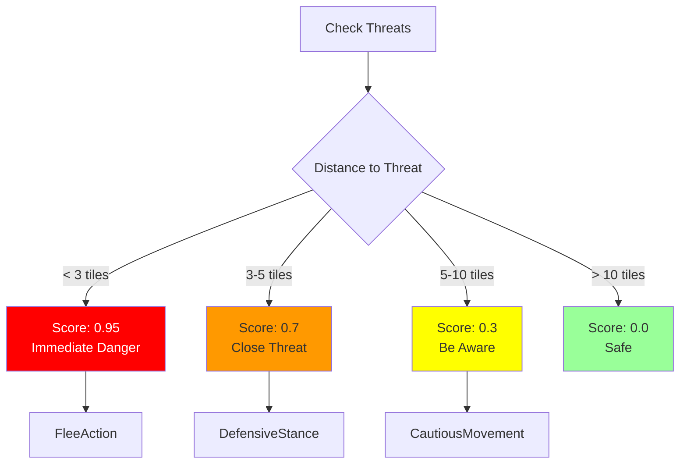
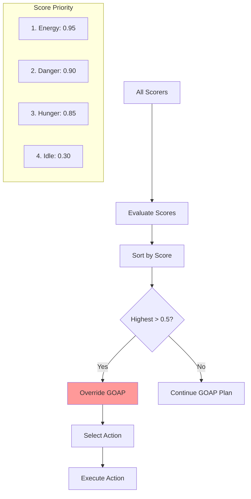
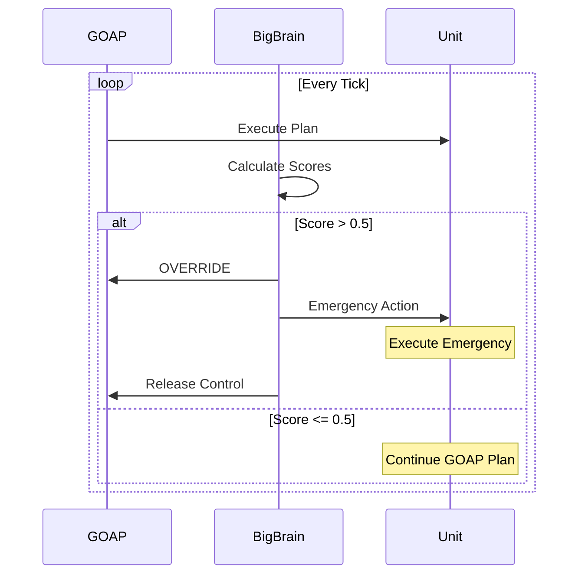
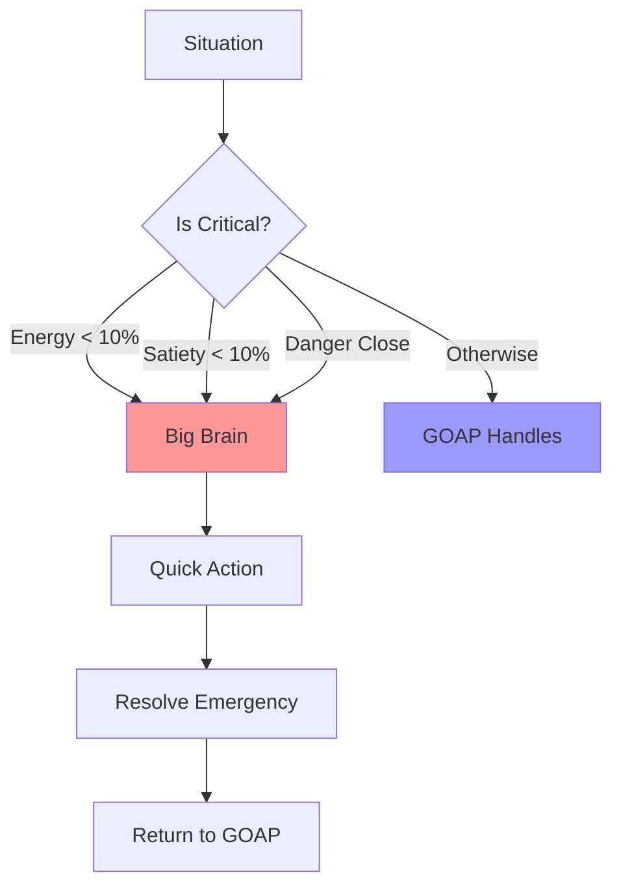

# Big Brain Reactive System

Big Brain provides immediate, reactive responses to urgent situations, overriding GOAP planning when emergencies arise. It acts as the survival instinct layer of the AI.

## 🧠 Big Brain Overview



## 🎯 Core Components

### Big Brain Structure
```rust
pub struct Thinker {
    pub scorers: Vec<Box<dyn Scorer>>,
    pub current_action: Option<ActionState>,
    pub threshold: f32,  // 0.5 default
}

pub struct ActionState {
    pub action: Box<dyn Action>,
    pub score: f32,
    pub started_tick: u32,
}
```

### Scorer System
```rust
pub trait Scorer {
    fn score(&self, entity: Entity, world: &World) -> f32;
    fn action(&self) -> Box<dyn Action>;
}
```

## 🔋 Energy Scorer

**Purpose**: Prevent energy exhaustion through emergency napping

### Score Calculation


### Implementation
```rust
pub fn energy_scorer_system(
    mut query: Query<(&mut Score, &Energy), With<EnergyScorer>>,
) {
    for (mut score, energy) in query.iter_mut() {
        let energy_percent = energy.0 / 100.0;

        let score_value = if energy_percent <= 0.05 {
            0.95 + (0.05 - energy_percent)  // 0.95-1.0
        } else if energy_percent <= 0.1 {
            0.9 + (0.1 - energy_percent) * 0.5  // 0.9-0.95
        } else if energy_percent <= 0.2 {
            0.7 + (0.2 - energy_percent) * 2.0  // 0.7-0.9
        } else {
            0.0  // No emergency
        };

        score.set(score_value as f32);
    }
}
```

### Energy Response Actions
```rust
RestQuickAction {
    triggers_at: Score > 0.7,
    spawns: NapAction,
    duration: 50 ticks,
    recovery: +80 energy,
}
```

## 🍽️ Hunger Scorer

**Purpose**: Force eating when critically hungry

### Score Calculation


### Implementation
```rust
pub fn hunger_scorer_system(
    mut query: Query<(&mut Score, &Satiety, &FoodCount), With<HungerScorer>>,
) {
    for (mut score, satiety, food) in query.iter_mut() {
        let hunger_percent = 1.0 - (satiety.0 / 100.0);

        let base_score = if hunger_percent >= 0.95 {
            0.95  // Starving
        } else if hunger_percent >= 0.9 {
            0.85  // Very hungry
        } else if hunger_percent >= 0.8 {
            0.6   // Hungry
        } else if hunger_percent >= 0.7 {
            0.3   // Getting hungry
        } else {
            0.0   // Not hungry
        };

        // Boost score if we have food available
        let final_score = if food.0 > 0.0 && base_score > 0.3 {
            (base_score + 0.1).min(1.0)
        } else {
            base_score
        };

        score.set(final_score as f32);
    }
}
```

### Hunger Response Actions
```rust
PanicEatAction {
    triggers_at: Score > 0.85 AND FoodCount > 0,
    spawns: EatAction,
    immediate: true,
    restores: +20 satiety per food,
}
```

## ⚠️ Danger Scorer

**Purpose**: React to immediate threats (future implementation)

### Planned Score Calculation


## 😴 Idle Scorer

**Purpose**: Provide default behavior when no urgent needs

### Score Calculation
```rust
pub fn idle_scorer_system(
    mut query: Query<(&mut Score, &LastActionTime), With<IdleScorer>>,
) {
    for (mut score, last_action) in query.iter_mut() {
        let idle_time = current_tick - last_action.0;

        let score_value = if idle_time > 100 {
            0.3  // Been idle too long
        } else if idle_time > 50 {
            0.1  // Starting to get bored
        } else {
            0.0  // Recently active
        };

        score.set(score_value);
    }
}
```

### Idle Actions
```rust
WanderAction {
    triggers_at: Score > 0.1,
    behavior: Explore nearby area,
    range: 10 tiles,
    searches_for: Resources,
}
```

## 🔄 Score Aggregation

### Priority System


### Action Selection
```rust
pub fn select_action_system(
    query: Query<(&Score, &ActionType), With<Scorer>>,
    mut commands: Commands,
) {
    let mut best_score = 0.0;
    let mut best_action = None;

    for (score, action_type) in query.iter() {
        if score.0 > best_score && score.0 > THRESHOLD {
            best_score = score.0;
            best_action = Some(action_type);
        }
    }

    if let Some(action) = best_action {
        // Override GOAP and spawn emergency action
        spawn_emergency_action(commands, action);
    }
}
```

## 🎮 GOAP Integration

### Override Mechanism


### Handoff Protocol
```rust
pub fn handle_ai_handoff(
    entity: Entity,
    big_brain_score: f32,
    goap_plan: Option<&Plan>,
) {
    if big_brain_score > OVERRIDE_THRESHOLD {
        // Big Brain takes control
        pause_goap_plan(entity);
        execute_emergency_action(entity);
    } else if was_overriding(entity) {
        // Return control to GOAP
        resume_goap_plan(entity);
    }
}
```

## 📊 Score Visualization

### Real-Time Score Display
```
=== Big Brain Scores ===
Energy Scorer:  ████░░░░░░ 0.75 [ACTIVE]
Hunger Scorer:  ██░░░░░░░░ 0.20
Danger Scorer:  ░░░░░░░░░░ 0.00
Idle Scorer:    █░░░░░░░░░ 0.10

Current Action: RestQuickAction (NapAction)
Override Active: Yes
GOAP Suspended: Yes
```

## 🔧 Configuration

### Thresholds
```rust
pub const OVERRIDE_THRESHOLD: f32 = 0.5;  // When to override GOAP
pub const CRITICAL_THRESHOLD: f32 = 0.9;  // Immediate action
pub const RELEASE_THRESHOLD: f32 = 0.3;   // Return to GOAP
```

### Score Weights
```rust
pub struct ScorerWeights {
    energy: f32,    // 1.2 - Higher priority
    hunger: f32,    // 1.0 - Normal priority
    danger: f32,    // 1.5 - Highest priority
    idle: f32,      // 0.5 - Lower priority
}
```

## 🐛 Debugging Big Brain

### Common Issues

| Problem | Cause | Solution |
|---------|-------|----------|
| **Not triggering** | Score too low | Lower threshold |
| **Always overriding** | Score too high | Adjust calculation |
| **Wrong component** | Using old AIState | Use DOGOAP components |
| **Stuck in override** | Not releasing | Check release condition |

### Debug Commands
```rust
// Check current scores
Query<(&Score, &Name), With<Scorer>>

// Monitor overrides
Query<&BigBrainOverride>

// Track action spawning
[BIG_BRAIN] Spawning RestQuickAction at score 0.85
```

## 🎯 Design Philosophy

### Reactive Principles
1. **Immediate Response**: No planning delay
2. **Survival First**: Prioritize critical needs
3. **Simple Actions**: One action per emergency
4. **Quick Resolution**: Short duration actions
5. **Smooth Handoff**: Clean GOAP integration

### When Big Brain Activates


## 📈 Performance

### Scorer Performance
- **Score Calculation**: ~0.01ms per scorer
- **Action Selection**: ~0.1ms per tick
- **Override Check**: ~0.001ms
- **Memory Usage**: Minimal (scores only)

## Next Steps

- Learn about [GOAP Planning](goap-planning.md)
- Understand [Action System](actions-and-tasks.md)
- Explore [AI Coordination](ai-coordination.md)
- Read about [Emergency Responses](emergency-system.md)