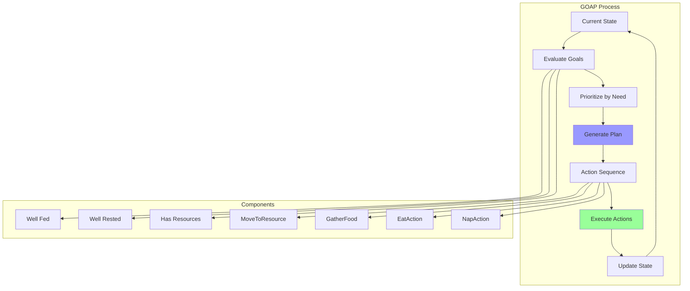
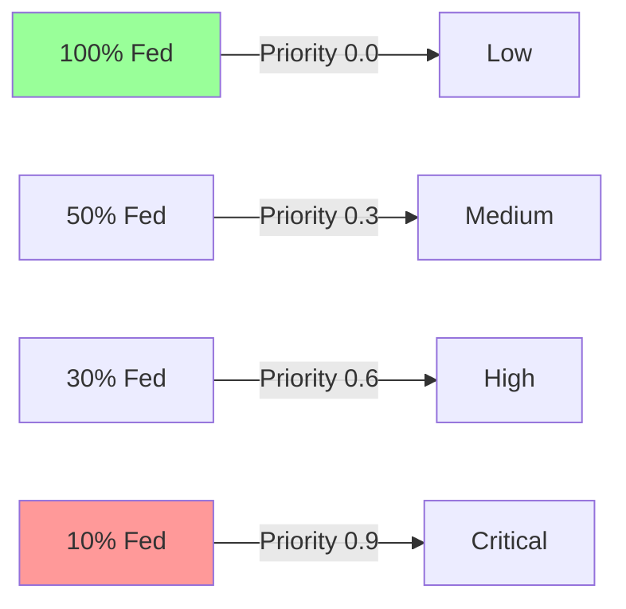
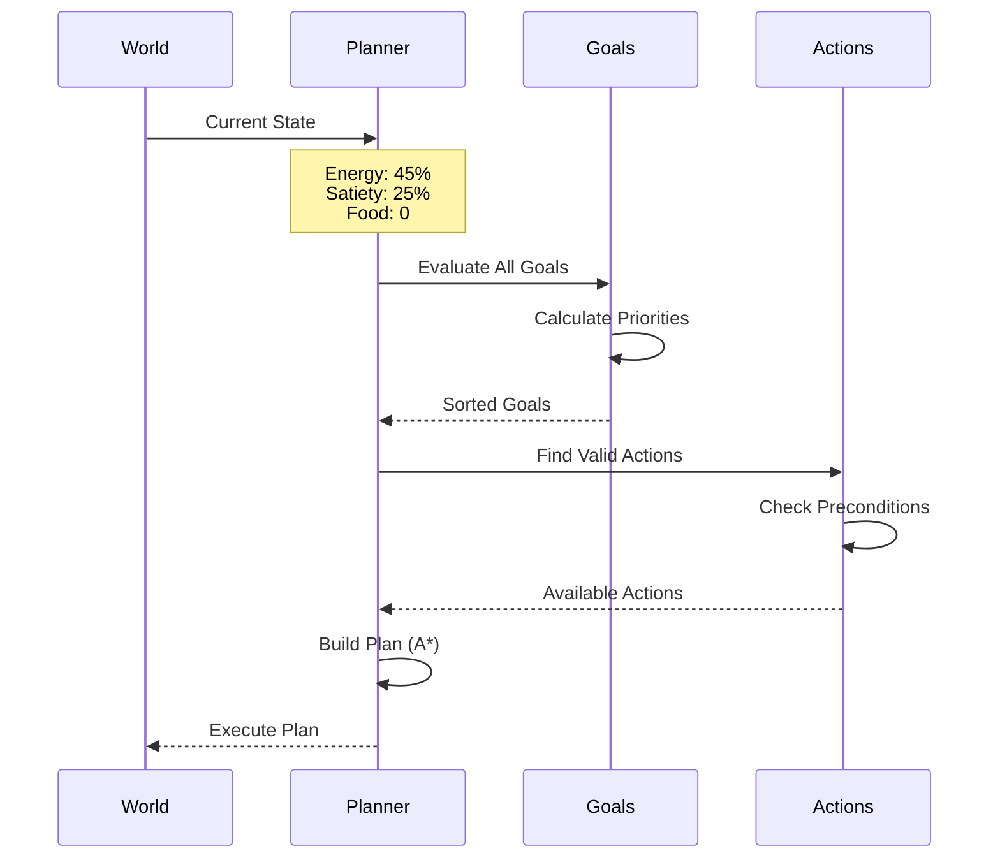
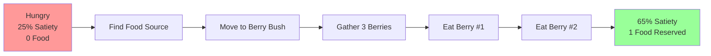
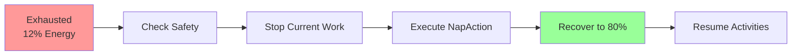
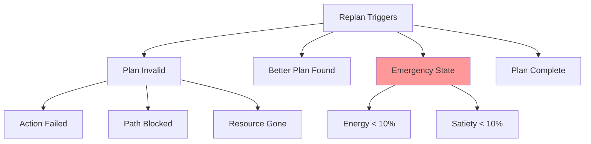
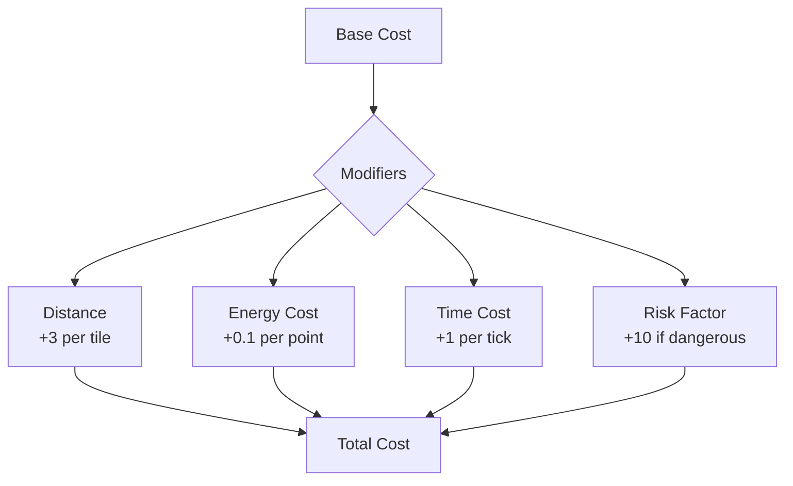
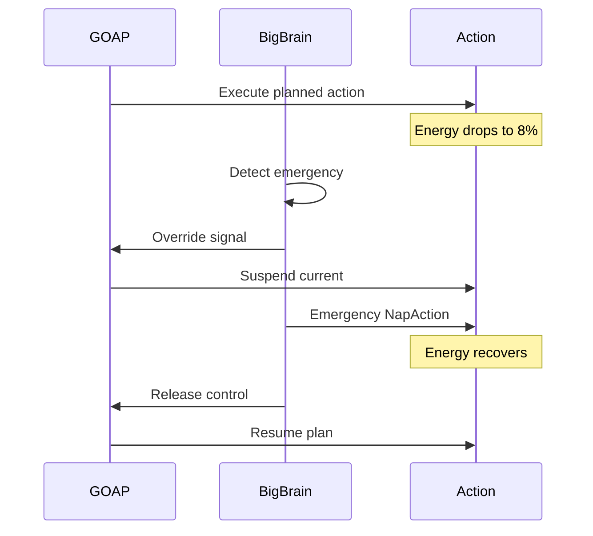

# GOAP Planning System

Goal-Oriented Action Planning (GOAP) provides intelligent long-term planning for units, creating multi-step action sequences to achieve goals based on current world state.

## 🧠 GOAP Overview



## 📋 Core Components

### GOAP Structure
```rust
pub struct Planner {
    pub current_plan: Option<Plan>,
    pub current_goal: Option<Goal>,
    pub replan_cooldown: u32,
}

pub struct Plan {
    pub goal: Goal,
    pub actions: Vec<Box<dyn Action>>,
    pub cost: f32,
}

pub struct Goal {
    pub name: String,
    pub conditions: Vec<Condition>,
    pub priority: f32,
}
```

## 🎯 Current Goals

### 1. Well Fed Goal
```rust
Goal {
    name: "goal_is_fed",
    condition: Satiety > 50.0,
    priority: Dynamic based on hunger,
}
```

**Priority Calculation**:


### 2. Well Rested Goal
```rust
Goal {
    name: "goal_well_rested",
    condition: Energy > 30.0,
    priority: Dynamic based on exhaustion,
}
```

**Energy Thresholds**:
- **30%+**: Preventive planning
- **20%**: Elevated priority
- **15%**: Urgent nap needed
- **10%**: Critical override

### 3. Has Food Goal
```rust
Goal {
    name: "goal_has_food",
    condition: FoodCount > 3.0,
    priority: 0.4 when inventory low,
}
```

**Triggers**:
- Food count < 3
- Near food source
- Satiety dropping

## 🔄 Planning Process

### State Evaluation


### Planning Algorithm
```rust
pub fn create_plan(
    current_state: WorldState,
    goal: Goal,
    available_actions: Vec<Action>,
) -> Option<Plan> {
    let mut open_set = BinaryHeap::new();
    let mut closed_set = HashSet::new();

    open_set.push(Node {
        state: current_state,
        actions: vec![],
        cost: 0.0,
    });

    while let Some(node) = open_set.pop() {
        if goal.is_satisfied(&node.state) {
            return Some(Plan {
                goal,
                actions: node.actions,
                cost: node.cost,
            });
        }

        for action in &available_actions {
            if action.can_execute(&node.state) {
                let new_state = action.apply(&node.state);
                let new_cost = node.cost + action.cost();

                if !closed_set.contains(&new_state) {
                    open_set.push(Node {
                        state: new_state,
                        actions: node.actions.clone().push(action),
                        cost: new_cost,
                    });
                }
            }
        }
        closed_set.insert(node.state);
    }
    None
}
```

## 🎬 Available Actions

### Action Properties
```rust
pub trait Action {
    fn preconditions(&self) -> Vec<Condition>;
    fn effects(&self) -> Vec<Effect>;
    fn cost(&self) -> f32;
    fn execute(&self, entity: Entity);
}
```

### Action Library

#### GatherFoodAction
```rust
Preconditions:
- NearBerryBush == 1.0
- Energy > 10.0

Effects:
- FoodCount += 3.0
- Energy -= 12.0

Cost: 30.0 (30 ticks)
```

#### EatAction
```rust
Preconditions:
- FoodCount > 0.0

Effects:
- Satiety += 20.0
- FoodCount -= 1.0

Cost: 1.0 (instant)
```

#### NapAction
```rust
Preconditions:
- Energy < 30.0

Effects:
- Energy += 80.0 (over time)

Cost: 50.0 (50 ticks)
```

#### MoveToResourceAction
```rust
Preconditions:
- HasPath == true

Effects:
- NearBerryBush = 1.0

Cost: Distance * 3.0
```

#### WanderAction
```rust
Preconditions:
- None (default action)

Effects:
- Explores map
- May find resources

Cost: 10.0
```

## 📊 Plan Examples

### Example 1: Hungry Unit


**Generated Plan**:
```
Goal: goal_is_fed (Satiety > 50)
Plan:
1. WanderAction (find resources)
2. MoveToResourceAction (to bush at 10,15)
3. GatherFoodAction (get 3 berries)
4. EatAction (consume berry)
5. EatAction (consume berry)
Total Cost: 62.0
```

### Example 2: Exhausted Unit


**Generated Plan**:
```
Goal: goal_well_rested (Energy > 30)
Plan:
1. NapAction (recover energy)
Total Cost: 50.0
```

## 🔀 Replanning

### Replan Triggers


### Replan System
```rust
pub fn check_replan_needed(
    planner: &Planner,
    current_state: &WorldState,
) -> bool {
    if planner.current_plan.is_none() {
        return true;
    }

    let plan = planner.current_plan.as_ref().unwrap();

    // Check if current action still valid
    if !plan.actions[0].can_execute(current_state) {
        return true;
    }

    // Check if goal already satisfied
    if plan.goal.is_satisfied(current_state) {
        return true;
    }

    // Check for emergencies
    if current_state.energy < 10.0 || current_state.satiety < 10.0 {
        return true;
    }

    false
}
```

## ⚖️ Cost Calculation

### Action Costs


### Cost Function
```rust
pub fn calculate_action_cost(
    action: &dyn Action,
    current_state: &WorldState,
    target_state: &WorldState,
) -> f32 {
    let base_cost = action.base_cost();
    let distance_cost = calculate_distance_cost(current_state, target_state);
    let energy_cost = action.energy_requirement() * 0.1;
    let time_cost = action.estimated_ticks() as f32;

    base_cost + distance_cost + energy_cost + time_cost
}
```

## 🎮 Integration with Big Brain

### Handoff Mechanism


## 🔍 Debugging GOAP

### Debug Output
```
=== GOAP Status ===
Current Goal: goal_is_fed
Goal Priority: 0.75
Current Plan: [MoveToResource, GatherFood, Eat, Eat]
Actions Completed: 1/4
Current Action: GatherFood
Action Progress: 45%
Estimated Completion: 17 ticks
Replan Cooldown: 0
```

### Common Issues

| Problem | Cause | Solution |
|---------|-------|----------|
| **No plan generated** | No valid action sequence | Check preconditions |
| **Infinite replanning** | Conditions changing | Add replan cooldown |
| **Stuck on action** | Precondition not met | Verify world state |
| **Wrong priorities** | Static priority values | Make dynamic |

## 📈 Performance

### Planning Metrics
- **Plan Generation**: ~1-5ms for typical plans
- **State Evaluation**: ~0.1ms per state
- **Action Validation**: ~0.01ms per action
- **Memory Usage**: ~1KB per plan

### Optimization Tips
1. Limit search depth to 10 actions
2. Cache frequently used plans
3. Use heuristics to prune search
4. Batch state evaluations

## Next Steps

- Learn about [Big Brain System](big-brain-reactive.md)
- Understand [Action Details](actions-and-tasks.md)
- Explore [State Management](../state-management.md)
- Read about [AI Coordination](ai-coordination.md)