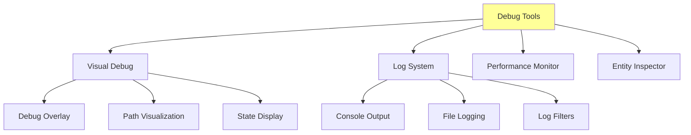
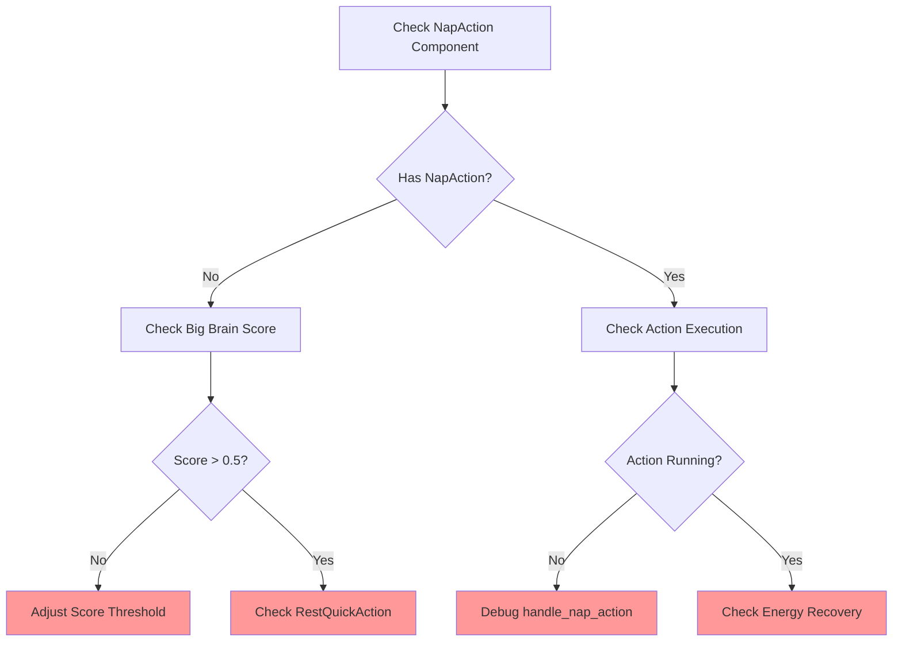
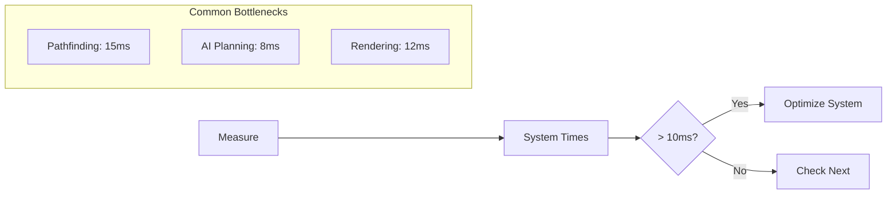

# Debugging and Monitoring Guide

Complete guide for debugging issues, monitoring performance, and understanding what's happening in your World Simulator.

## 🔍 Debug Overview



## 🎮 Debug Controls

### Keyboard Shortcuts
| Key | Function | Description |
|-----|----------|-------------|
| **Tab** | Toggle Debug Overlay | Show/hide debug info |
| **F1** | Entity Inspector | Select and inspect units |
| **F2** | Path Visualization | Show movement paths |
| **F3** | Resource Claims | Display claimed resources |
| **F4** | AI State Display | Show GOAP/Big Brain states |
| **F5** | Performance Monitor | FPS, TPS, memory usage |
| **~** | Console | Open debug console |

## 📊 Debug Overlay

### Information Display
```
╔════════════════════════════════════╗
║ FPS: 60 | TPS: 10.0 | Tick: 1523  ║
║ Units: 5 | Resources: 25           ║
║ Memory: 45MB | CPU: 23%            ║
╠════════════════════════════════════╣
║ Actions:                           ║
║   Napping: 2                       ║
║   Gathering: 1                     ║
║   Moving: 1                        ║
║   Idle: 1                          ║
╠════════════════════════════════════╣
║ Avg Energy: 67%                    ║
║ Avg Satiety: 45%                   ║
║ Food Available: 12 bushes          ║
╚════════════════════════════════════╝
```

## 🐛 Common Issues & Solutions

### Unit Stuck at 0% Energy

**Symptoms**: Unit energy at 0%, not napping

**Debug Steps**:


**Debug Commands**:
```rust
// Check for NapAction
cargo run -- --debug-query "NapAction"

// Monitor energy recovery
RUST_LOG=debug cargo run | grep "ENERGY"

// Watch Big Brain scores
RUST_LOG=trace cargo run | grep "BIG_BRAIN"
```

### Units Not Gathering Food

**Symptoms**: Hungry units ignore berry bushes

**Debug Checklist**:
1. ✓ Check resource claims
2. ✓ Verify pathfinding
3. ✓ Check GOAP planning
4. ✓ Verify work system

**Debug Output**:
```
[GOAP] Unit 1: No path to resource
[CLAIMS] BerryBush #5: Claimed by Unit 2
[WORK] Unit 1: Cannot start work - no valid target
```

### Performance Issues

**Symptoms**: Low FPS, stuttering

**Performance Analysis**:


## 📝 Logging System

### Log Levels
```rust
// Set environment variable
RUST_LOG=debug cargo run

// Log levels:
// - error: Critical errors only
// - warn: Warnings and errors
// - info: General information (default)
// - debug: Detailed debugging
// - trace: Everything (verbose)
```

### Log Categories
| Category | Tag | Purpose |
|----------|-----|---------|
| **Ticks** | `[TICK]` | Tick counter and timing |
| **AI** | `[GOAP]` `[BIG_BRAIN]` | AI decisions |
| **Movement** | `[MOVE]` | Pathfinding and movement |
| **Work** | `[WORK]` | Resource gathering |
| **Needs** | `[NEEDS]` | Energy and hunger |
| **Failsafe** | `[DOGOAP_FAILSAFE]` | Emergency systems |

### Custom Log Filters
```bash
# Only show AI decisions
RUST_LOG=debug cargo run | grep -E "\[GOAP\]|\[BIG_BRAIN\]"

# Monitor energy issues
RUST_LOG=debug cargo run | grep -E "energy|Energy|ENERGY"

# Track specific unit
RUST_LOG=debug cargo run | grep "Peasant 1"
```

## 🔬 Entity Inspector

### Inspecting Units
```
=== Entity Inspector: Peasant 1 ===
Entity ID: 4v1
Position: (15, 22)
─────────────────────────
Components:
  ✓ NameComponent: "Peasant 1"
  ✓ Energy: 45.3
  ✓ Satiety: 67.8
  ✓ FoodCount: 2
  ✓ GridPosition: (15, 22)
  ✓ GridMovement: Moving
  ✓ Planner: Has plan (3 actions)
  ✓ WorkProgress: Gathering (45%)
─────────────────────────
Current Action: GatherFoodAction
Target: BerryBush #12
Time in Action: 15 ticks
```

### Query Commands
```rust
// Query specific components
query.single::<(&Energy, &Satiety)>()

// Find all units with condition
query.iter().filter(|(_, energy)| energy.0 < 20.0)

// Check action states
query.iter::<With<NapAction>>()
```

## 📈 Performance Monitoring

### System Profiling
```
=== System Performance ===
┌─────────────────────────┬────────┬────────┐
│ System                  │ Time   │ %      │
├─────────────────────────┼────────┼────────┤
│ needs_update_system     │ 2.3ms  │ 23%    │
│ goap_planning_system    │ 3.1ms  │ 31%    │
│ big_brain_system        │ 0.8ms  │ 8%     │
│ movement_system         │ 1.5ms  │ 15%    │
│ work_system            │ 1.2ms  │ 12%    │
│ rendering              │ 1.1ms  │ 11%    │
└─────────────────────────┴────────┴────────┘
Total: 10.0ms (100 TPS target)
```

### Memory Profiling
```rust
// Enable memory tracking
#[cfg(debug_assertions)]
fn track_memory() {
    let mem = ALLOCATOR.allocated();
    debug!("Memory: {} MB", mem / 1_000_000);
}
```

## 🎯 State Visualization

### GOAP Plan Display


**Legend**:
- ✓ Completed
- ⚡ In Progress
- ○ Planned

### Big Brain Scores
```
Energy:  ████████░░ 0.82 🔴
Hunger:  ██░░░░░░░░ 0.20
Danger:  ░░░░░░░░░░ 0.00
Idle:    █░░░░░░░░░ 0.10
```

## 🛠️ Debug Commands

### Console Commands
```bash
# Spawn unit at position
/spawn unit 10 15

# Set unit energy
/set Peasant1 energy 50

# Force action
/force Peasant1 nap

# Toggle pause
/pause

# Change speed
/speed 2.0

# Save state
/save debug_save

# Load state
/load debug_save
```

## 📊 Monitoring Scripts

### Watch Energy Levels
```bash
#!/bin/bash
# monitor_energy.sh
while true; do
    clear
    echo "=== Energy Monitor ==="
    cargo run -- --query "Energy" | head -20
    sleep 1
done
```

### Track Performance
```bash
#!/bin/bash
# monitor_perf.sh
RUST_LOG=info cargo run 2>&1 | grep -E "FPS:|TPS:" --line-buffered
```

## 🔍 Advanced Debugging

### Conditional Breakpoints
```rust
// Break when energy critical
if energy.0 < 5.0 {
    println!("BREAKPOINT: {} has critical energy", name.0);
    // Set debugger breakpoint here
}
```

### State Dumps
```rust
// Dump world state
fn dump_world_state(world: &World) {
    let mut file = File::create("world_dump.json").unwrap();
    for (entity, name, energy, satiety) in query.iter() {
        writeln!(file, "{:?}: E:{} S:{}",
                 name, energy.0, satiety.0);
    }
}
```

## 📝 Debug Best Practices

### 1. Start Simple
- Begin with high-level logs (info)
- Gradually increase verbosity
- Focus on one system at a time

### 2. Use Markers
```rust
debug!("=== MARKER: Starting gathering ===");
// Suspicious code
debug!("=== MARKER: Gathering complete ===");
```

### 3. Binary Search
- Disable half the systems
- Identify which half has the issue
- Repeat until found

### 4. State Comparison
- Save known good state
- Compare with problematic state
- Identify differences

## 🚨 Emergency Debugging

### When Everything Breaks
1. **Minimal Mode**: `cargo run -- --minimal`
2. **Single Unit**: Spawn only one unit
3. **Disable AI**: `--no-ai` flag
4. **Step Mode**: `--step` for tick-by-tick
5. **Recovery**: Load last good save

## Next Steps

- Learn about [Performance Optimization](performance.md)
- Understand [Save System](../save-system.md)
- Explore [Testing Guide](testing.md)
- Read about [Configuration](../configuration.md)