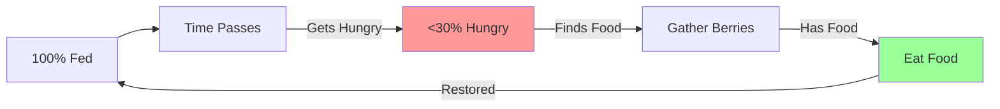

# Quick Start Guide

Get the World Simulator running and understand the basics in minutes!

## 🚀 Installation

### Prerequisites
- Rust 1.70+ ([install](https://rustup.rs/))
- Git

### Clone and Run
```bash
# Clone the repository
git clone https://github.com/yourusername/world-simulator.git
cd world-simulator

# Run the simulation
cargo run -p world_sim_simple

# Or with specific log level
RUST_LOG=info cargo run -p world_sim_simple
```

## 🎮 Controls

### Camera
- **Arrow Keys**: Move camera
- **Mouse Wheel**: Zoom in/out
- **Click Unit**: Select and view details

### Simulation
- **Space**: Pause/Resume
- **1-5**: Change simulation speed
- **Tab**: Toggle debug overlay
- **Escape**: Open menu

## 👁️ Understanding the Display

### Main View
```
🌍 World Resources:
   🌲 8 trees available
   🫐 12 berry bushes with fruit

👤 Peasant 1 🚶 @ (27,45) - 🎯 going to Berry bush
   Energy [●●●●●●○○○○] (60%)
   Satiety [●●○○○○○○○○] (20%)
   Inventory: 2🫐
```

### Unit States
- 🚶 **Moving**: Going somewhere
- 🔨 **Working**: Gathering/Building
- 😴 **Napping**: Recovering energy
- 🍽️ **Eating**: Consuming food
- 🔍 **Searching**: Looking for resources

## 🧠 How Units Think

Units are fully autonomous with a dual-AI system:

### Normal Conditions (Energy > 20%)
**GOAP Planning** creates multi-step plans:
```
Plan: [Move to Bush] → [Gather Berries] → [Eat Food]
```

### Emergency Conditions (Energy < 20%)
**Big Brain** interrupts with immediate action:
```
EMERGENCY: Energy at 15% → Force Nap NOW
```

## 📊 Understanding Needs

### Energy System


### Hunger System


## 🎯 Common Scenarios

### Scenario 1: Unit is Starving
```
Problem: Peasant has 0% satiety
↓
GOAP: Plans to find food
↓
Action: Searches for berry bushes
↓
Found: Moves to nearest bush
↓
Gather: Collects 3 berries (3 seconds)
↓
Eat: Consumes berries (+20 satiety each)
```

### Scenario 2: Unit is Exhausted
```
Problem: Peasant has 5% energy
↓
Big Brain: Emergency override!
↓
Action: Immediate NapAction
↓
Recovery: +1.6 energy per tick
↓
Complete: Resumes work at 80% energy
```

### Scenario 3: Resource Competition
```
Situation: Two units want same berry bush
↓
System: First unit claims resource
↓
Second: Finds alternative bush
↓
Claims: Expire after 60 ticks if abandoned
```

## 🔧 Configuration

### Adjust Simulation Speed
```rust
// In tick_config.rs
pub const TICKS_PER_SECOND: u32 = 10;  // Default
pub const TICKS_PER_SECOND: u32 = 20;  // Faster
```

### Modify Need Rates
```rust
// Energy depletion
pub const ENERGY_LOSS_PER_TICK: u32 = 300;  // per tick

// Hunger increase
pub const HUNGER_PER_TICK: u32 = 500;  // per tick
```

### Change Recovery Rates
```rust
// Nap recovery
pub const ENERGY_NAP_RECOVERY_PER_TICK: u32 = 8000;  // Fast

// Idle recovery
pub const ENERGY_RECOVERY_PER_TICK: u32 = 2000;  // Slow
```

## 📈 Performance Tips

### For Better FPS
1. Reduce unit count (spawn fewer peasants)
2. Lower simulation speed
3. Disable debug overlays
4. Close other applications

### For Faster Simulation
1. Increase simulation speed (keys 1-5)
2. Ensure good CPU cooling
3. Close background processes

## 🐛 Troubleshooting

### Units Not Moving
- Check if paused (Space key)
- Verify pathfinding (no obstacles)
- Check energy levels (might be exhausted)

### Units Dying
- Currently units can't die!
- At 0% energy, failsafe forces nap
- At 0% hunger, they prioritize food

### Performance Issues
```bash
# Run with release optimizations
cargo run -p world_sim_simple --release

# Check debug output
RUST_LOG=debug cargo run -p world_sim_simple
```

## 📊 Monitoring Units

### Key Indicators
1. **Energy Bar**: Green = Good, Red = Critical
2. **Satiety Bar**: Blue = Fed, Red = Starving
3. **Current Action**: Shows what unit is doing
4. **Inventory**: Items unit is carrying

### Debug Information
Press `Tab` for debug overlay:
```
FPS: 60 | TPS: 10.0 | Tick: 1523
Units: 5 | Resources: 25
Active Actions: 2 Nap, 1 Gather, 2 Move
```

## 🎮 First Session Goals

1. **Watch Units Survive**: See how they manage needs
2. **Observe Energy Cycles**: Watch work → tired → nap → work
3. **Track Food Gathering**: See berry collection and consumption
4. **Notice AI Switches**: GOAP planning vs Big Brain emergencies
5. **Experiment with Speed**: Try different simulation speeds

## 📚 Next Steps

Once comfortable with basics:

1. **Deep Dive**: Read [Architecture Overview](../architecture/overview.md)
2. **Understand AI**: Learn about [Behavior System](../behavior-system/README.md)
3. **Modify Code**: Follow [Adding Behaviors](adding-behaviors.md)
4. **Debug Issues**: Use [Debugging Guide](debugging.md)

## 💡 Tips for New Users

1. **Start Small**: Begin with 3-5 units
2. **Watch One Unit**: Click to select and follow
3. **Pause Often**: Space key to analyze situations
4. **Read Logs**: Understand decision making
5. **Experiment**: Try different scenarios

## 🎯 Success Indicators

Your simulation is working well when:
- ✅ Units maintain energy between 20-80%
- ✅ Units eat before starving
- ✅ Berry bushes regenerate over time
- ✅ No units stuck at 0% energy
- ✅ Smooth movement between tiles

---

**Congratulations!** You're now ready to explore the autonomous world of the World Simulator. Watch as your units live, work, and survive on their own!