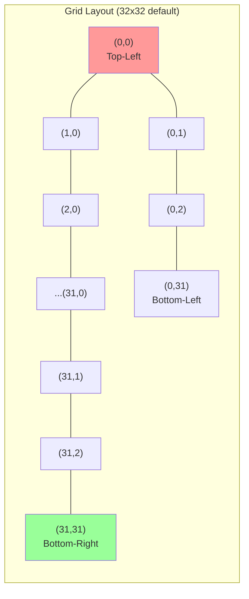
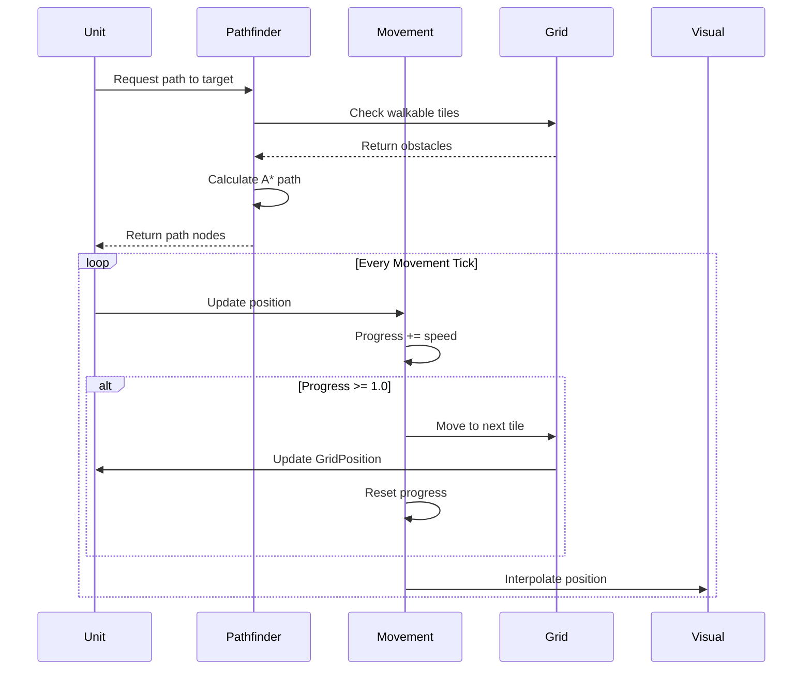
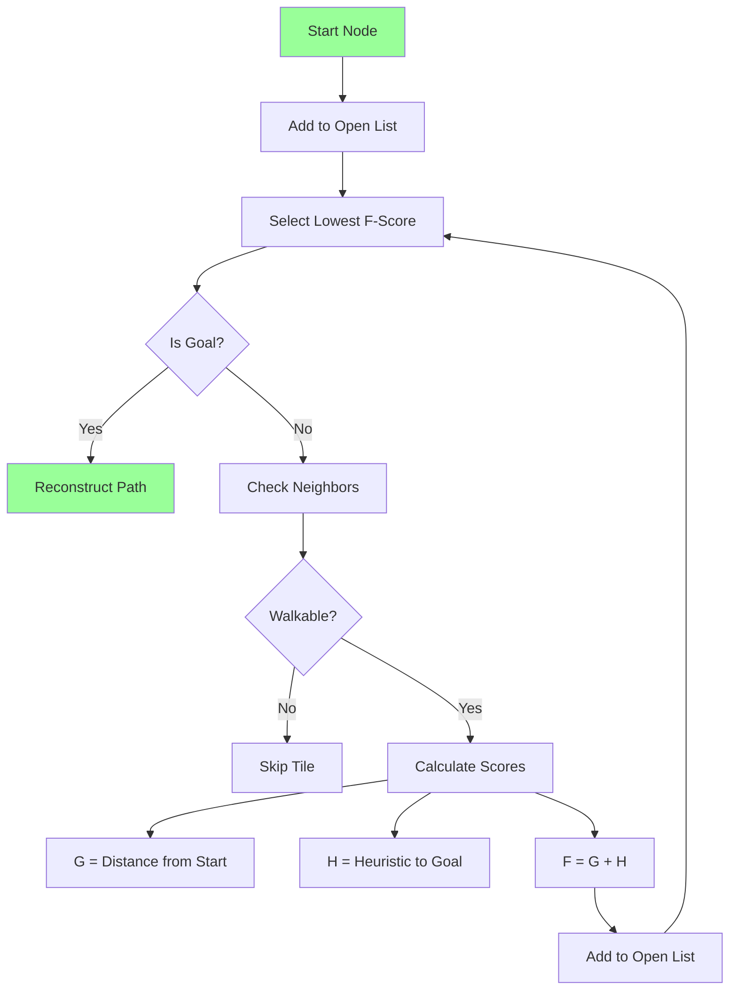
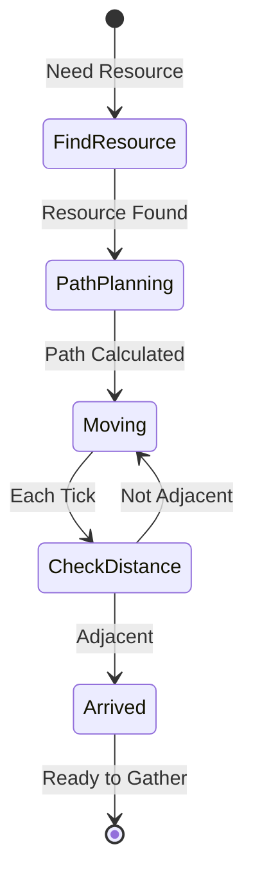
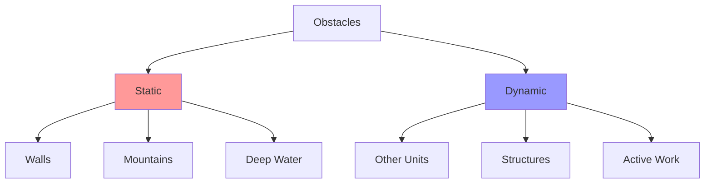
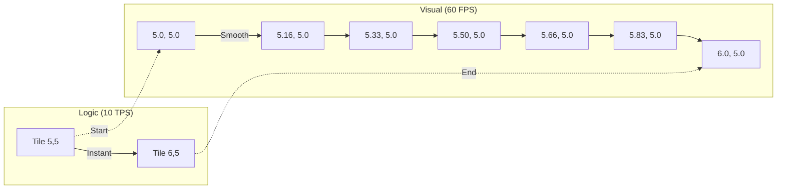

# Movement and Pathfinding System

The World Simulator uses a grid-based movement system with A* pathfinding for intelligent navigation across the tile-based world.

## 🗺️ Grid-Based World

### Coordinate System


### Grid Components
```rust
// Position on the grid
pub struct GridPosition {
    pub x: i32,
    pub y: i32,
}

// Movement state
pub struct GridMovement {
    pub path: Option<Vec<IVec2>>,     // Current path
    pub current_index: usize,          // Index in path
    pub is_moving: bool,               // Movement flag
    pub movement_progress: f32,        // Progress to next tile
    pub speed: f32,                    // Tiles per second
}
```

## 🚶 Movement Mechanics

### Movement Process


### Movement Speed
| Activity | Ticks per Tile | Real Time | Energy Cost |
|----------|---------------|-----------|-------------|
| **Normal Walk** | 3 ticks | 0.3 seconds | -0.05/tick |
| **Encumbered** | 5 ticks | 0.5 seconds | -0.08/tick |
| **Running** | 2 ticks | 0.2 seconds | -0.15/tick |
| **Exhausted** | 6 ticks | 0.6 seconds | -0.03/tick |

## 🧭 A* Pathfinding Algorithm

### How A* Works


### Score Calculations
```rust
// G-Score: Actual distance from start
g_score = parent.g_score + distance_to_neighbor

// H-Score: Heuristic (Manhattan distance)
h_score = abs(current.x - goal.x) + abs(current.y - goal.y)

// F-Score: Total estimated cost
f_score = g_score + h_score
```

### Pathfinding Implementation
```rust
pub fn find_path(
    start: IVec2,
    goal: IVec2,
    grid: &Grid
) -> Option<Vec<IVec2>> {
    let mut open_set = BinaryHeap::new();
    let mut came_from = HashMap::new();
    let mut g_score = HashMap::new();

    open_set.push(Node { pos: start, f_score: 0 });
    g_score.insert(start, 0);

    while let Some(current) = open_set.pop() {
        if current.pos == goal {
            return Some(reconstruct_path(came_from, current.pos));
        }

        for neighbor in get_neighbors(current.pos, grid) {
            let tentative_g = g_score[&current.pos] + 1;

            if tentative_g < *g_score.get(&neighbor).unwrap_or(&i32::MAX) {
                came_from.insert(neighbor, current.pos);
                g_score.insert(neighbor, tentative_g);
                let f = tentative_g + heuristic(neighbor, goal);
                open_set.push(Node { pos: neighbor, f_score: f });
            }
        }
    }
    None
}
```

## 🎯 Movement Actions

### MoveToResourceAction
Navigates unit to a specific resource for gathering.



### Movement Execution
```rust
pub fn execute_movement_system(
    mut query: Query<(
        Entity,
        &mut GridPosition,
        &mut GridMovement,
        &mut Transform
    )>
) {
    for (entity, mut grid_pos, mut movement, mut transform) in query.iter_mut() {
        if !movement.is_moving || movement.path.is_none() {
            continue;
        }

        let path = movement.path.as_ref().unwrap();
        if movement.current_index >= path.len() {
            // Reached destination
            movement.is_moving = false;
            movement.path = None;
            continue;
        }

        // Progress toward next tile
        movement.movement_progress += MOVE_PROGRESS_PER_TICK;

        if movement.movement_progress >= MAX_WORK_PROGRESS {
            // Move to next tile
            let next_pos = path[movement.current_index];
            grid_pos.x = next_pos.x;
            grid_pos.y = next_pos.y;

            movement.current_index += 1;
            movement.movement_progress = 0.0;
        }
    }
}
```

## 🚧 Collision Detection

### Obstacle Types


### Collision Handling
```rust
pub fn is_walkable(pos: IVec2, grid: &Grid) -> bool {
    // Check bounds
    if pos.x < 0 || pos.x >= GRID_SIZE as i32
    || pos.y < 0 || pos.y >= GRID_SIZE as i32 {
        return false;
    }

    // Check terrain
    if grid.get_terrain(pos) == Terrain::Mountain {
        return false;
    }

    // Check units (dynamic)
    if grid.has_unit_at(pos) {
        return false;  // Can't walk through units
    }

    // Check buildings
    if grid.has_building_at(pos) {
        return false;
    }

    true
}
```

## 🎨 Visual Interpolation

Movement happens discretely on ticks, but visuals interpolate smoothly at 60 FPS:

### Interpolation System


### Interpolation Code
```rust
pub fn interpolate_movement_system(
    mut query: Query<(&GridPosition, &mut Transform)>
) {
    for (grid_pos, mut transform) in query.iter_mut() {
        let target = grid_to_world(grid_pos);

        // Smooth interpolation (10% per frame)
        transform.translation = transform.translation.lerp(
            target,
            0.1
        );
    }
}
```

## 🔍 Path Visualization

### Debug Display
```
Unit Path:
Start: (5, 10)
Goal: (15, 20)
Path: [(5,10) → (6,10) → (7,11) → (8,12) → ... → (15,20)]
Length: 18 tiles
Est. Time: 5.4 seconds
Energy Cost: ~0.9
```

### Path States
| State | Description | Visual |
|-------|-------------|--------|
| **Planning** | Calculating path | Yellow dots |
| **Following** | Moving along path | Green line |
| **Blocked** | Path obstructed | Red X |
| **Recalculating** | Finding new path | Orange dots |
| **Arrived** | Reached destination | Green check |

## ⚡ Optimization Strategies

### Hierarchical Pathfinding
For long distances, use two-level pathfinding:
1. **Region Level**: Find path between regions
2. **Local Level**: Navigate within regions

### Path Caching
```rust
pub struct PathCache {
    cache: HashMap<(IVec2, IVec2), Vec<IVec2>>,
    max_age: u32,
}
```

### Dynamic Recalculation
Only recalculate when:
- Path becomes blocked
- Target moves significantly
- Better path becomes available

## 🐛 Common Issues

### Problem: Unit Stuck
**Cause**: Path blocked after calculation
**Solution**: Detect stuck state, recalculate path
```rust
if movement_progress == 0.0 && ticks_since_last_move > 10 {
    recalculate_path();
}
```

### Problem: Units Overlap
**Cause**: Multiple units pathfinding to same tile
**Solution**: Implement local avoidance
```rust
if next_tile_occupied {
    wait_or_find_alternate_path();
}
```

### Problem: Inefficient Paths
**Cause**: Not considering diagonal movement
**Solution**: Add diagonal pathfinding (if allowed)
```rust
neighbors.extend(&[
    pos + IVec2::new(1, 1),   // Diagonal
    pos + IVec2::new(-1, 1),
    pos + IVec2::new(1, -1),
    pos + IVec2::new(-1, -1),
]);
```

## 📊 Performance Metrics

### Pathfinding Performance
| Grid Size | Max Path Length | Calculation Time |
|-----------|----------------|------------------|
| 32x32 | 45 tiles | ~1ms |
| 64x64 | 90 tiles | ~5ms |
| 128x128 | 180 tiles | ~20ms |

### Movement Updates
- **Per Unit**: 0.1ms per tick
- **100 Units**: 10ms per tick
- **Interpolation**: 0.01ms per frame

## Next Steps

- Learn about [Work System](needs-system/work-system.md)
- Understand [Resource Gathering](needs-system/resource-gathering.md)
- Explore [Collision System](collision-avoidance.md)
- Read about [Grid World](architecture/grid-world.md)