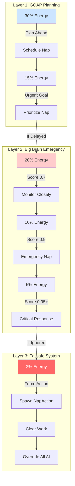
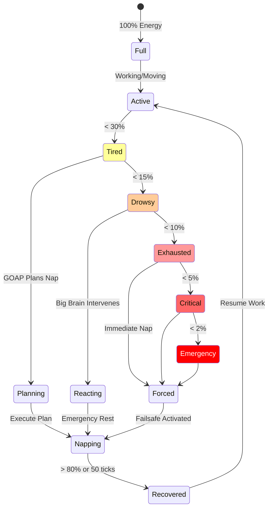
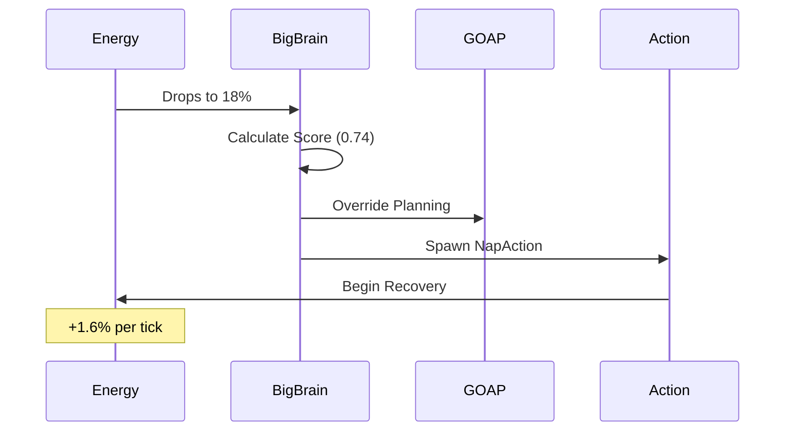
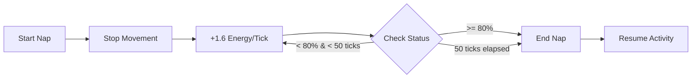
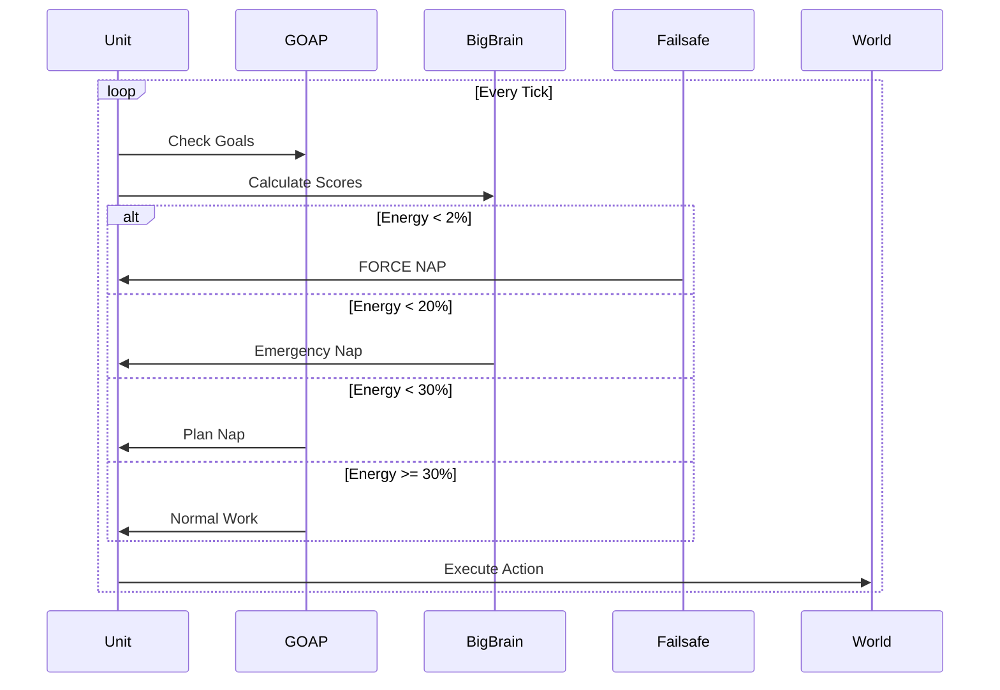

# Three-Layer Energy Management System

The energy system ensures units never get stuck at 0% energy through multiple safety layers, each designed to catch and handle energy depletion at different stages.

## ⚡ Energy Overview

Energy represents a unit's stamina and ability to perform actions:
- **Range**: 0-100 (float in DOAP system)
- **Critical Level**: < 20% triggers emergency responses
- **Exhaustion**: < 10% severely limits actions
- **Recovery**: Through napping (fast) or idling (slow)

## 🛡️ The Three-Layer Protection System



## 📊 Energy States and Transitions



## 🔋 Layer 1: GOAP Preventive Planning (30%+)

The first line of defense - planning ahead before energy becomes critical.

### Goals and Thresholds
```rust
// Early warning - start planning
goal_well_rested: Energy > 30%

// Critical threshold - must rest soon
goal_rested: Energy > 15%
```

### GOAP Planning Process
1. **At 30% Energy**: Adds nap to future plans
2. **At 20% Energy**: Elevates nap priority
3. **At 15% Energy**: Nap becomes top priority
4. **Execution**: Finds safe spot and naps

### Planning Example
```
Current Energy: 35%
GOAP Plan:
1. Finish current gathering (5 ticks)
2. Move to safe area (10 ticks)
3. Execute NapAction (50 ticks)
4. Resume work after recovery
```

## 🚨 Layer 2: Big Brain Emergency Response (5-20%)

Immediate intervention when GOAP planning isn't fast enough.

### Score Calculation
```rust
pub fn energy_scorer_system() {
    let energy_percent = energy.0 / 100.0;
    let score = if energy_percent <= 0.05 {
        0.95 + (0.05 - energy_percent)  // 0.95-1.0 for 5-0%
    } else if energy_percent <= 0.1 {
        0.9 + (0.1 - energy_percent) * 0.5  // 0.9-0.95 for 10-5%
    } else if energy_percent <= 0.2 {
        0.7 + (0.2 - energy_percent) * 2.0  // 0.7-0.9 for 20-10%
    } else {
        0.0  // No emergency above 20%
    };
}
```

### Emergency Response Flow


### Response Priority
| Energy | Score | Response |
|--------|-------|----------|
| 20-15% | 0.7-0.8 | Monitor, prepare to override |
| 15-10% | 0.8-0.9 | High priority override |
| 10-5% | 0.9-0.95 | Emergency override |
| 5-0% | 0.95-1.0 | Critical emergency |

## 🔒 Layer 3: Absolute Failsafe (0-2%)

The final safety net that bypasses all AI systems.

### Failsafe Trigger
```rust
// In update_needs_system
if energy.0 <= 2.0 && nap.is_none() {
    debug.log("EMERGENCY: Forcing nap at {:.1}% energy!");
    commands.entity(entity).insert(NapAction::default());
    commands.entity(entity).remove::<WorkProgress>();
    continue;  // Skip normal energy update
}
```

### Failsafe Characteristics
- **Unconditional**: Ignores all other systems
- **Immediate**: No planning or scoring
- **Forceful**: Clears all work in progress
- **Logged**: Creates emergency log entry
- **Guaranteed**: Cannot be overridden

## 💤 Nap Mechanics

### NapAction Execution
```rust
pub struct NapAction {
    ticks_remaining: u32,  // Default: 50 ticks
    started: bool,
}
```

### Recovery Process


### Recovery Rates Comparison
| Activity | Energy Change/Tick | Notes |
|----------|-------------------|-------|
| **Napping** | +1.6 | Fastest recovery |
| **Idle** | +0.5 | Slow recovery |
| **Moving** | -0.05 | Minimal drain |
| **Gathering** | -0.4 | Moderate work |
| **Mining** | -0.8 | Heavy work |

### Recovery Time Estimates
From 0% energy:
- **To 50%**: ~31 ticks napping (3.1 seconds)
- **To 80%**: ~50 ticks napping (5 seconds)
- **To 100%**: ~63 ticks napping (6.3 seconds)

## 🔄 System Coordination

How the three layers work together:



## 📈 Energy Flow Example

Real scenario of unit energy management:

```
Tick 0:   Energy 100% - Working (gathering berries)
Tick 100: Energy 60%  - Still working
Tick 200: Energy 35%  - GOAP plans future nap
Tick 250: Energy 28%  - Finishes current task
Tick 260: Energy 26%  - Moving to safe spot
Tick 280: Energy 22%  - Arrives at safe spot
Tick 285: Energy 18%  - Big Brain detects emergency
Tick 286: Energy 17%  - Big Brain spawns NapAction
Tick 336: Energy 80%  - Nap complete (50 ticks)
Tick 337: Energy 80%  - Resumes gathering
```

## 🐛 Debugging Energy Issues

### Common Problems and Solutions

| Problem | Cause | Solution |
|---------|-------|----------|
| **Stuck at 0%** | Failsafe not triggering | Check if NapAction component exists |
| **Not napping** | Work overriding | Verify Big Brain scorer using DOGOAP Energy |
| **Slow recovery** | Wrong recovery rate | Check nap vs idle detection |
| **Immediate exhaustion** | Heavy work | Balance work energy costs |

### Debug Commands
```rust
// Check energy state
Query<(&Energy, Option<&NapAction>)>

// Monitor layer activation
[DOGOAP_FAILSAFE] - Layer 3 triggered
[BIG_BRAIN] - Layer 2 triggered
[GOAP_EXEC] - Layer 1 planning
```

### Energy Monitoring
```
Unit Status:
- Energy: 15.3%
- State: Drowsy
- Action: NapAction (12/50 ticks)
- Layer: Big Brain Emergency
```

## 🎯 Design Principles

1. **Never Stuck**: Multiple failsafes prevent 0% energy deadlock
2. **Gradual Response**: Earlier intervention = smoother gameplay
3. **AI Cooperation**: Systems hand off control gracefully
4. **Player Visibility**: Clear visual/log feedback
5. **Performance**: Minimal overhead in checks

## Next Steps

- Learn about [Hunger System](hunger-system.md)
- Understand [Work System](work-system.md)
- Explore [GOAP Planning](../behavior-system/goap-planning.md)
- Read about [Big Brain](../behavior-system/big-brain-reactive.md)