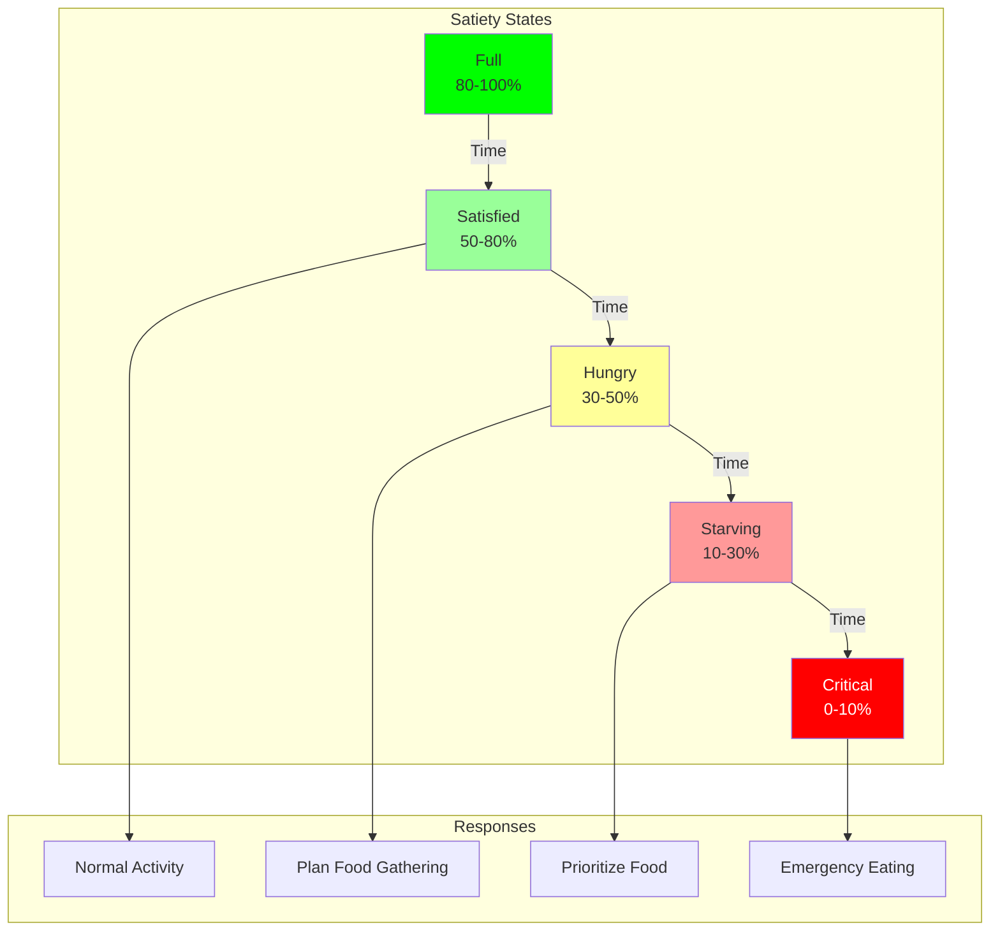
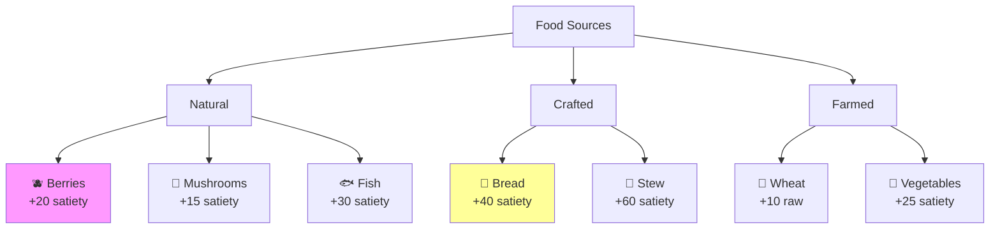
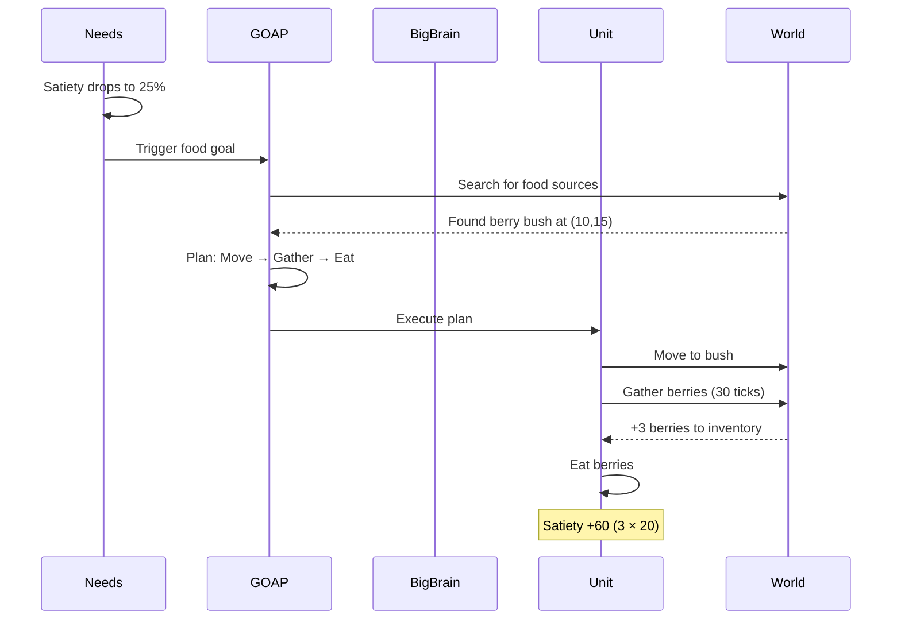
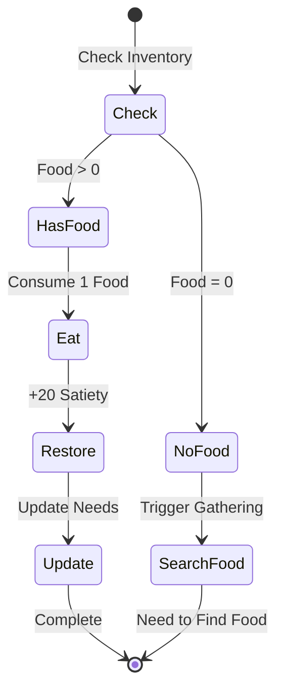
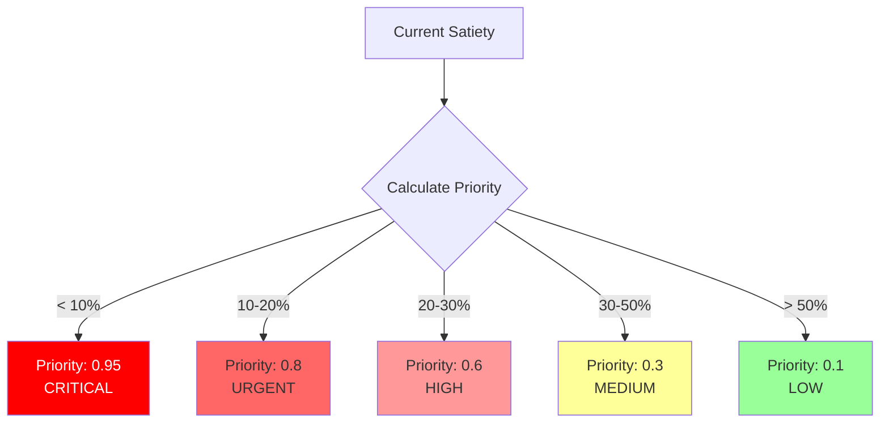
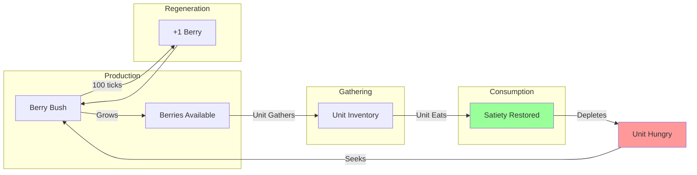
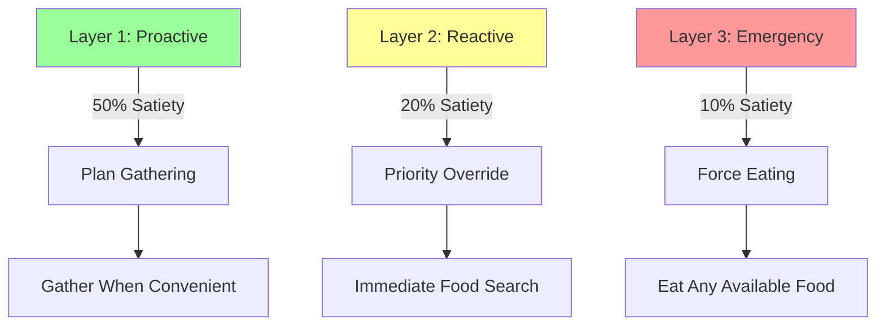

# Hunger and Food System

The hunger system drives units to seek, gather, and consume food to maintain their satiety levels and survive in the world.

## 🍽️ Hunger Overview



## 📊 Satiety Mechanics

### Satiety Component
```rust
pub struct Satiety(pub f64);  // 0-100 scale in DOGOAP

// Display version for UI
pub struct UnitNeedsV2 {
    pub hunger: f32,    // Inverted: 100 - satiety
    pub satiety: f32,   // Direct copy from DOGOAP
}
```

### Hunger Progression
```mermaid
graph LR
    T0[Tick 0<br/>100% Full] -->|10 ticks| T10[96% Full]
    T10 -->|10 ticks| T20[92% Full]
    T20 -->|...|  T250[0% Starving]

    subgraph "Depletion Rate"
        Rate[0.4 per tick<br/>4.0 per second<br/>240 per minute]
    end
```

### Hunger Thresholds
| Satiety | State | AI Response | Visual |
|---------|-------|-------------|--------|
| 80-100% | **Full** | No food concerns | Green bar |
| 50-80% | **Satisfied** | Low priority planning | Light green |
| 30-50% | **Hungry** | Active food seeking | Yellow bar |
| 10-30% | **Starving** | High priority food | Orange bar |
| 0-10% | **Critical** | Emergency override | Red flashing |

## 🥘 Food System

### Food Sources


### Food Properties
```rust
pub struct Food {
    pub food_type: FoodType,
    pub satiety_value: f32,    // How much it restores
    pub spoilage_time: Option<u32>,  // Ticks until spoiled
    pub stack_size: u32,       // Max inventory stack
}

pub enum FoodType {
    Berry,      // Basic, common
    Mushroom,   // Foraging
    Fish,       // Requires fishing
    Bread,      // Requires crafting
    Stew,       // Complex crafting
    RawMeat,    // From hunting
    CookedMeat, // Processed
}
```

## 🍓 Food Gathering

### Gathering Decision Flow


### Food Inventory Management
```rust
pub struct FoodCount(pub f64);  // DOGOAP component

pub fn update_food_inventory(
    entity: Entity,
    food_type: FoodType,
    amount: i32,
) {
    // Add or remove food
    food_count.0 = (food_count.0 as i32 + amount).max(0) as f64;
}
```

## 🍴 Eating Mechanics

### EatAction Execution


### Eating Code
```rust
pub fn handle_eat_action(
    mut commands: Commands,
    mut query: Query<(
        Entity,
        &EatAction,
        &mut Satiety,
        &mut FoodCount,
    )>,
) {
    for (entity, _, mut satiety, mut food_count) in query.iter_mut() {
        if food_count.0 > 0.0 {
            // Consume food
            food_count.0 -= 1.0;

            // Restore satiety
            satiety.0 = (satiety.0 + 20.0).min(100.0);

            // Remove action
            commands.entity(entity).remove::<EatAction>();
        }
    }
}
```

## 🎯 Hunger-Driven Behavior

### GOAP Food Goals
```rust
// Primary food goal
Goal {
    name: "goal_is_fed",
    target: Satiety > 50.0,
    priority: based_on_current_satiety,
}

// Emergency food goal
Goal {
    name: "goal_not_starving",
    target: Satiety > 10.0,
    priority: CRITICAL,
}
```

### Priority Calculation


## 🔄 Food Chain

### Complete Food Cycle


## 📈 Satiety Management

### Optimal Eating Strategy
```
Maintain between 40-80% satiety:
- Eat at 40% to avoid urgency
- Don't overeat past 80%
- Keep 2-3 food in reserve
- Gather when passing resources
```

### Satiety Timeline Example
```
Time     Satiety  Action
0:00     100%     Full, working
0:10     60%      Still comfortable
0:15     40%      Plan to eat soon
0:16     40%      Eat 1 berry
0:16     60%      Back to work
0:26     20%      Urgent: Find food
0:27     20%      Gathering berries
0:30     20%      Got 3 berries
0:30     80%      Eat 3 berries
```

## 🚨 Starvation Prevention

### Multi-Layer Food Security


### Starvation Handling
```rust
pub fn prevent_starvation_system(
    mut commands: Commands,
    query: Query<(Entity, &Satiety, &FoodCount)>,
) {
    for (entity, satiety, food) in query.iter() {
        if satiety.0 <= 10.0 {
            if food.0 > 0.0 {
                // Force immediate eating
                commands.entity(entity).insert(EatAction);
            } else {
                // Force food search
                commands.entity(entity).insert(
                    SearchFoodEmergency { radius: 50 }
                );
            }
        }
    }
}
```

## 🍔 Food Efficiency

### Nutritional Values
| Food | Satiety | Gather Time | Efficiency |
|------|---------|-------------|------------|
| **Berry** | +20 | 30 ticks | 0.67 sat/tick |
| **Mushroom** | +15 | 20 ticks | 0.75 sat/tick |
| **Fish** | +30 | 60 ticks | 0.50 sat/tick |
| **Bread** | +40 | 100 ticks* | 0.40 sat/tick |
| **Stew** | +60 | 150 ticks* | 0.40 sat/tick |

*Includes preparation time

## 🐛 Debugging Hunger

### Common Issues

| Problem | Cause | Solution |
|---------|-------|----------|
| **Constant hunger** | High depletion rate | Adjust HUNGER_PER_TICK |
| **Won't eat** | No food in inventory | Check gathering success |
| **Ignores food** | Low priority | Check GOAP goals |
| **Starves with food** | EatAction not spawning | Check trigger conditions |

### Debug Display
```
=== Hunger Status ===
Unit: Peasant 1
Satiety: 35.2% (Hungry)
Food in Inventory: 2 berries
Last Ate: 142 ticks ago
Next Meal Planned: In 50 ticks
Depletion Rate: 0.4/tick
Time Until Starving: 63 ticks
```

## Next Steps

- Learn about [Energy Management](energy-management.md)
- Understand [Work System](work-system.md)
- Explore [Food Production](../farming-system.md)
- Read about [Cooking System](../cooking-system.md)