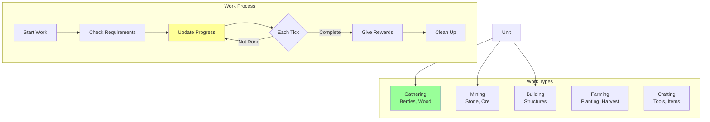
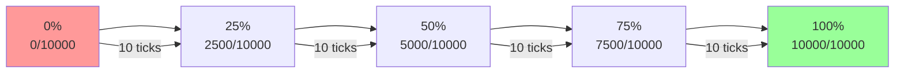
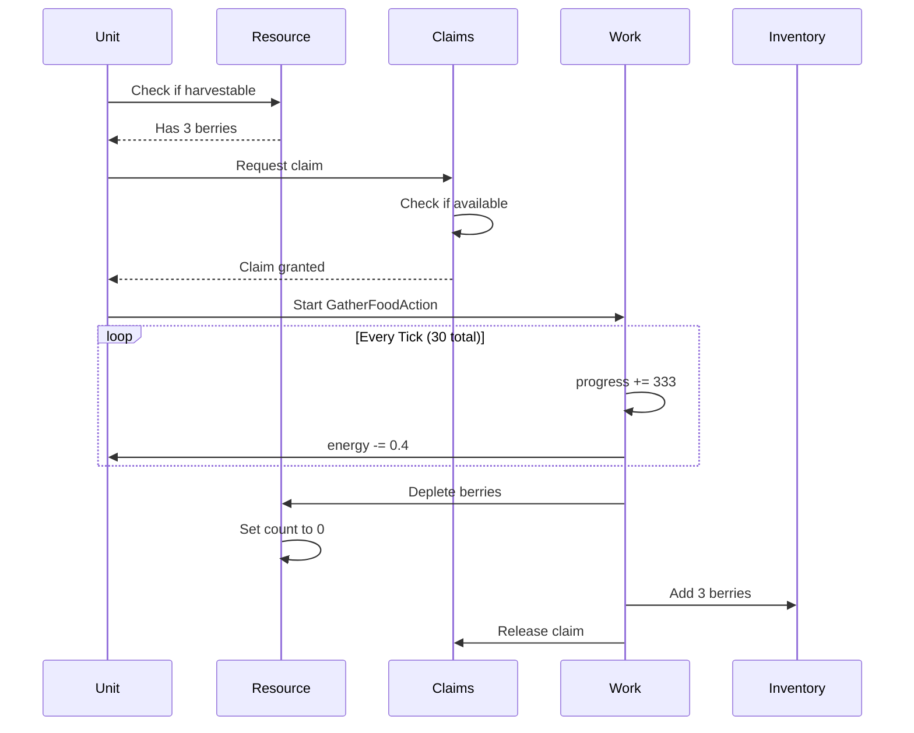
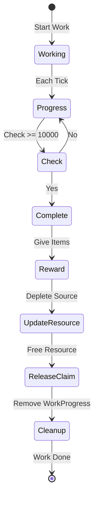
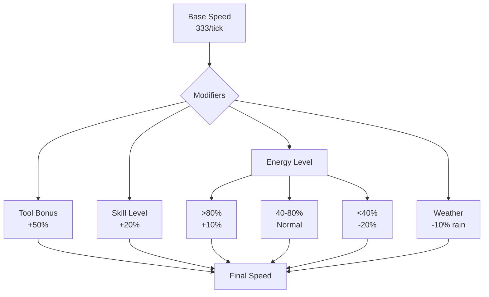
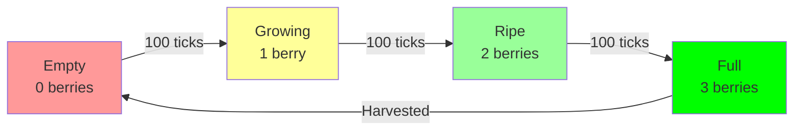
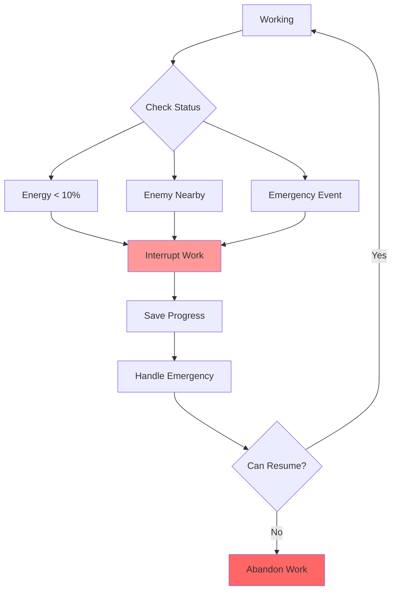

# Work System and Resource Gathering

The work system manages all productive activities units perform, from gathering berries to building structures, with progress tracking and resource management.

## 🔨 Work System Overview



## 📦 Core Components

### WorkProgress Component
```rust
pub struct WorkProgress {
    pub work_type: WorkType,           // Type of work
    pub progress: u32,                  // 0 to 10,000
    pub target_entity: Option<Entity>,  // Resource being worked
    pub ticks_elapsed: u32,             // Time spent working
    pub energy_cost: f32,               // Energy per tick
}

pub enum WorkType {
    Gathering(ResourceWork),
    Mining(ResourceWork),
    Building(BuildWork),
    Farming(FarmWork),
    Crafting(CraftWork),
}
```

### Progress Mechanics


## 🫐 Resource Gathering

### Gathering Process


### Gathering Statistics
| Resource | Work Time | Progress/Tick | Yield | Energy Cost |
|----------|-----------|---------------|-------|-------------|
| **Berries** | 30 ticks | 333 | 3 items | 12 total |
| **Wood** | 50 ticks | 200 | 5 logs | 20 total |
| **Stone** | 80 ticks | 125 | 2 stones | 40 total |
| **Herbs** | 20 ticks | 500 | 2 herbs | 8 total |

### Resource Claiming System
```rust
pub struct ResourceClaims {
    claims: HashMap<Entity, ClaimInfo>,
}

pub struct ClaimInfo {
    claimer: Entity,        // Who claimed it
    resource: Entity,       // What was claimed
    timestamp: u32,         // When claimed (tick)
    timeout: u32,          // Auto-release after 60 ticks
}
```

## ⚙️ Work Execution

### Work Update System
```rust
pub fn update_work_system(
    mut commands: Commands,
    mut work_query: Query<(
        Entity,
        &mut WorkProgress,
        &mut Energy,
        &mut FoodCount,
    )>,
    mut resources: Query<&mut ResourceNode>,
) {
    for (entity, mut work, mut energy, mut food) in work_query.iter_mut() {
        // Deduct energy cost
        energy.0 -= work.energy_cost;

        // Update progress
        work.progress += WORK_PROGRESS_PER_TICK;
        work.ticks_elapsed += 1;

        // Check completion
        if work.progress >= MAX_WORK_PROGRESS {
            complete_work(&mut commands, entity, &work, &mut food);
        }
    }
}
```

### Work Completion


## 🏗️ Work Types

### Gathering Work
**Purpose**: Collect renewable resources
```rust
pub struct ResourceWork {
    pub resource_type: ResourceType,
    pub amount: u32,
    pub tool_efficiency: f32,  // 1.0 = no tool, 1.5 = with tool
}
```

**Resources**:
- 🫐 **Berries**: Food source, regrows over time
- 🌿 **Herbs**: Medicine crafting, rare spawn
- 🌾 **Wheat**: Farming product, must plant first
- 🍄 **Mushrooms**: Found in shaded areas

### Mining Work
**Purpose**: Extract non-renewable resources
```rust
pub struct MiningWork {
    pub ore_type: OreType,
    pub vein_remaining: u32,
    pub hardness: f32,  // Affects mining speed
}
```

**Resources**:
- ⛏️ **Stone**: Building material, common
- 🪨 **Iron Ore**: Tool crafting, underground
- 💎 **Gems**: Trade value, very rare
- 🧱 **Clay**: Pottery and bricks

### Building Work
**Purpose**: Construct structures
```rust
pub struct BuildWork {
    pub building_type: BuildingType,
    pub materials_needed: Vec<(ResourceType, u32)>,
    pub stages: Vec<BuildStage>,
}
```

**Structures**:
- 🏠 **House**: Shelter, stores items
- 🏭 **Workshop**: Crafting station
- 🌾 **Farm Plot**: Growing food
- 🗼 **Watchtower**: Vision range

## 📊 Work Efficiency

### Factors Affecting Speed


### Efficiency Calculation
```rust
pub fn calculate_work_speed(
    base_speed: f32,
    tool_bonus: f32,
    skill_level: f32,
    energy_percent: f32,
) -> f32 {
    let energy_modifier = match energy_percent {
        x if x > 0.8 => 1.1,   // Well rested bonus
        x if x < 0.4 => 0.8,   // Tired penalty
        _ => 1.0,              // Normal
    };

    base_speed * tool_bonus * skill_level * energy_modifier
}
```

## 🔄 Resource Regeneration

### Berry Bush Regeneration


### Regeneration System
```rust
pub fn resource_regeneration_system(
    mut resources: Query<(&mut ResourceNode, &ResourceType)>
) {
    for (mut node, resource_type) in resources.iter_mut() {
        match resource_type {
            ResourceType::BerryBush => {
                if node.amount < 3 && tick % 100 == 0 {
                    node.amount += 1;  // Grow 1 berry per 100 ticks
                }
            },
            ResourceType::Tree => {
                // Trees regrow slowly after being cut
                if node.amount == 0 && tick % 1000 == 0 {
                    node.amount = 5;  // Full regrowth
                }
            },
            _ => {} // Non-renewable resources
        }
    }
}
```

## 🎯 Work Planning

### GOAP Work Goals
```rust
// Need food → Plan gathering
goal_has_food: FoodCount > 5
action_gather: Gathering berries when near bush

// Need materials → Plan mining
goal_has_stone: StoneCount > 10
action_mine: Mining stone from deposits

// Need shelter → Plan building
goal_has_shelter: HasHouse == true
action_build: Construct basic house
```

## 🚫 Work Interruption

### Interruption Conditions


### Interruption Handling
```rust
pub fn handle_work_interruption(
    entity: Entity,
    work: &WorkProgress,
    reason: InterruptReason,
) {
    match reason {
        InterruptReason::LowEnergy => {
            // Save progress, go rest
            save_work_progress(entity, work);
            spawn_nap_action(entity);
        },
        InterruptReason::Danger => {
            // Abandon work, flee
            abandon_work(entity);
            spawn_flee_action(entity);
        },
        InterruptReason::Emergency => {
            // Quick save, handle emergency
            quick_save(work);
            handle_emergency(entity);
        }
    }
}
```

## 📈 Work Queue System

### Multi-Step Work Plans
```rust
pub struct WorkQueue {
    tasks: VecDeque<WorkTask>,
    current: Option<WorkTask>,
    priority: Priority,
}

pub struct WorkTask {
    work_type: WorkType,
    target: Entity,
    dependencies: Vec<WorkTask>,
    estimated_time: u32,
}
```

### Queue Example
```
Build House Queue:
1. Gather Wood (5 logs) - 50 ticks
2. Mine Stone (10 stones) - 160 ticks
3. Clear Build Site - 20 ticks
4. Lay Foundation - 100 ticks
5. Build Walls - 200 ticks
6. Add Roof - 150 ticks
Total: 680 ticks (68 seconds)
```

## 🔍 Debugging Work

### Debug Display
```
=== Work Status ===
Unit: Peasant 1
Current Work: Gathering Berries
Progress: 6666/10000 (66.6%)
Time Elapsed: 20 ticks
Est. Remaining: 10 ticks
Energy Cost: 0.4/tick
Target: BerryBush #23
Claimed: Yes (timeout in 40 ticks)
```

### Common Issues

| Problem | Cause | Solution |
|---------|-------|----------|
| **Work not starting** | Resource claimed | Find alternative resource |
| **Slow progress** | Low energy | Rest before working |
| **Work abandoned** | Interruption | Check emergency handlers |
| **No reward** | Resource depleted | Verify resource state |

## Next Steps

- Learn about [Hunger System](hunger-system.md)
- Understand [Resource Claims](resource-claims.md)
- Explore [Building System](../building-system.md)
- Read about [Crafting](../crafting-system.md)